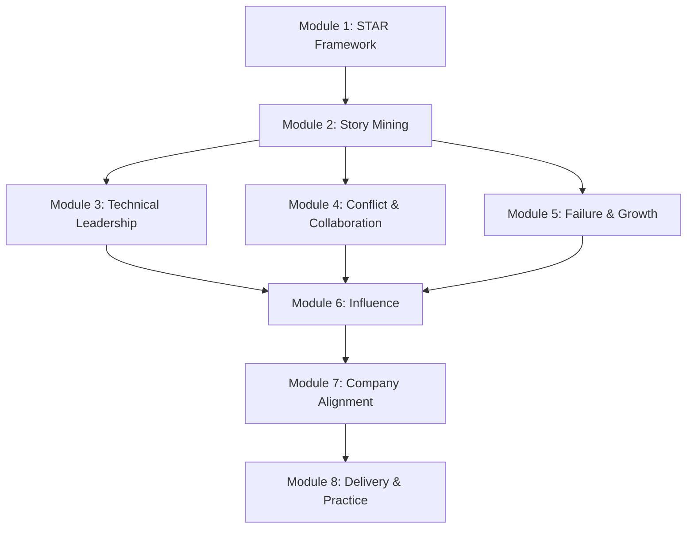

# Course Structure for Behavioral Rounds

## Learning Path

### Progression
**Beginner → Intermediate → Advanced**

- Beginner: STAR fundamentals, basic story preparation
- Intermediate: Category mastery, follow-up handling
- Advanced: Company alignment, delivery excellence

### Prerequisites
- None - suitable for all levels
- Helpful: Some work experience to draw stories from

## Module Overview

| Module | Title | Level | Focus |
|--------|-------|-------|-------|
| 1 | STAR Framework Mastery | Beginner | Core framework and structure |
| 2 | Story Mining & Preparation | Beginner | Building your story bank |
| 3 | Technical Leadership Stories | Intermediate | Decision-making, mentoring |
| 4 | Conflict & Collaboration | Intermediate | Difficult conversations, teamwork |
| 5 | Failure & Growth Mindset | Intermediate | Handling failure questions |
| 6 | Influence Without Authority | Advanced | Staff-level leadership |
| 7 | Company Value Alignment | Advanced | Tailoring for specific companies |
| 8 | Delivery & Practice | Advanced | Interview simulation |

---

## Modules

### Module 1: STAR Framework Mastery
**Level:** Beginner

**Learning Objectives:**
- Understand the STAR framework structure
- Apply correct time allocation (15/15/50/20)
- Recognize common STAR mistakes
- Practice basic STAR responses

**Key Concepts:**
- Situation (context setting)
- Task (your responsibility)
- Action (what YOU did)
- Result (outcomes + learnings)

**Dependencies:** None

---

### Module 2: Story Mining & Preparation
**Level:** Beginner

**Learning Objectives:**
- Identify impactful stories from your experience
- Create a comprehensive story matrix
- Write and refine 10-15 core stories
- Organize stories by category

**Key Concepts:**
- Story selection criteria
- Impact quantification
- Story matrix organization
- Story variation techniques

**Dependencies:** Module 1

---

### Module 3: Technical Leadership Stories
**Level:** Intermediate

**Learning Objectives:**
- Craft compelling technical decision stories
- Demonstrate mentorship and guidance
- Show code quality and standards leadership
- Balance technical depth with accessibility

**Key Concepts:**
- Decision-making frameworks
- Trade-off communication
- Mentorship patterns
- Technical influence

**Dependencies:** Modules 1, 2

---

### Module 4: Conflict & Collaboration
**Level:** Intermediate

**Learning Objectives:**
- Navigate conflict questions professionally
- Demonstrate collaborative problem-solving
- Show stakeholder management skills
- Handle difficult feedback discussions

**Key Concepts:**
- Conflict resolution frameworks
- Crucial conversations approach
- Stakeholder mapping
- Feedback delivery patterns

**Dependencies:** Modules 1, 2

---

### Module 5: Failure & Growth Mindset
**Level:** Intermediate

**Learning Objectives:**
- Select appropriate failure stories
- Own failures without excuses
- Demonstrate concrete learning and change
- Show self-awareness and humility

**Key Concepts:**
- Failure selection criteria
- Ownership vs blame
- Growth demonstration
- Applied learning evidence

**Dependencies:** Modules 1, 2

---

### Module 6: Influence Without Authority
**Level:** Advanced

**Learning Objectives:**
- Demonstrate staff-level influence patterns
- Show cross-team alignment abilities
- Navigate organizational complexity
- Lead without formal authority

**Key Concepts:**
- Influence tactics hierarchy
- Coalition building
- Stakeholder alignment
- Organizational navigation

**Dependencies:** Modules 1-4

---

### Module 7: Company Value Alignment
**Level:** Advanced

**Learning Objectives:**
- Research and understand company values
- Map stories to company principles
- Adapt language and framing
- Demonstrate authentic cultural fit

**Key Concepts:**
- Company research strategies
- Value-story mapping
- Authentic adaptation
- Culture signal recognition

**Dependencies:** Modules 1-6

---

### Module 8: Delivery & Practice
**Level:** Advanced

**Learning Objectives:**
- Execute full behavioral interviews
- Handle follow-up questions smoothly
- Manage time effectively
- Project confidence and authenticity

**Key Concepts:**
- Interview pacing
- Follow-up handling
- Presence and delivery
- Recovery techniques

**Dependencies:** Modules 1-7

---

## Course Flow Diagram

## Assessment Strategy

### Per-Module Assessment
- Self-check quizzes (3-5 questions)
- Story writing exercises
- Peer practice sessions

### Final Assessment
- Mock behavioral interview
- Self-evaluation rubric
- Story portfolio review

## Time Estimates

| Module | Study Time | Practice Time | Total |
|--------|------------|---------------|-------|
| 1 | 1 hour | 1 hour | 2 hours |
| 2 | 2 hours | 3 hours | 5 hours |
| 3 | 1.5 hours | 2 hours | 3.5 hours |
| 4 | 1.5 hours | 2 hours | 3.5 hours |
| 5 | 1 hour | 2 hours | 3 hours |
| 6 | 1.5 hours | 2 hours | 3.5 hours |
| 7 | 2 hours | 2 hours | 4 hours |
| 8 | 1 hour | 4 hours | 5 hours |
| **Total** | **11.5 hours** | **18 hours** | **29.5 hours** |

## Recommended Schedule

### Intensive (1 week)
- Days 1-2: Modules 1-2
- Days 3-4: Modules 3-5
- Days 5-6: Modules 6-7
- Day 7: Module 8 + Mock interviews

### Standard (2 weeks)
- Week 1: Modules 1-4
- Week 2: Modules 5-8 + Practice

### Extended (4 weeks)
- Week 1: Modules 1-2 + Deep story development
- Week 2: Modules 3-4 + Practice
- Week 3: Modules 5-6 + Practice
- Week 4: Modules 7-8 + Mock interviews
