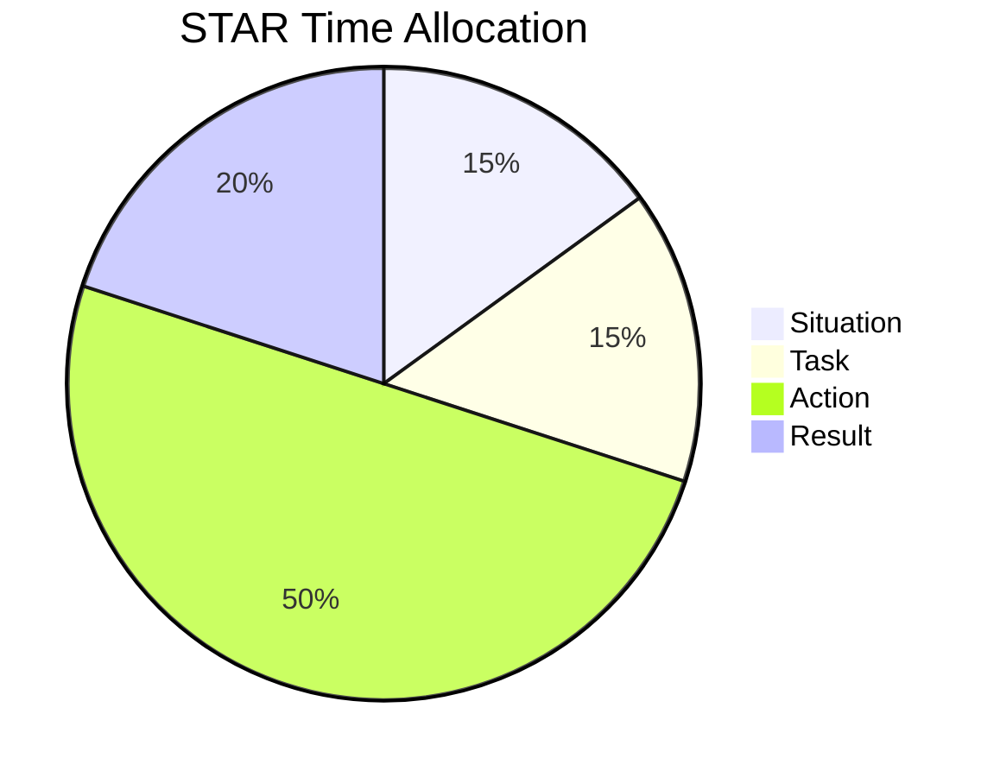
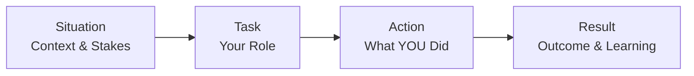

# Module 1: STAR Framework Mastery

## Learning Objectives

By the end of this module, learners will be able to:
1. Explain each component of the STAR framework
2. Apply correct time allocation (15/15/50/20) to responses
3. Identify and avoid common STAR mistakes
4. Construct a basic STAR response from scratch

## Core Content

### Lesson 1.1: Understanding STAR (15 minutes)

**Concept:** STAR is a structured method for answering behavioral interview questions.

```
S - Situation: Set the context
T - Task: Define your responsibility
A - Action: Detail what YOU did
R - Result: Share outcomes and learnings
```

**Key Points:**
- Originally developed by DDI (Development Dimensions International)
- Used by most major tech companies
- Ensures complete, structured answers
- Helps interviewers assess consistent criteria

### Lesson 1.2: Time Allocation (10 minutes)

**For a 2-3 minute response:**

| Component | Percentage | Time (2 min) | Time (3 min) |
|-----------|------------|--------------|--------------|
| Situation | 15% | 18 sec | 27 sec |
| Task | 15% | 18 sec | 27 sec |
| Action | 50% | 60 sec | 90 sec |
| Result | 20% | 24 sec | 36 sec |

**Why Action is 50%:**
- This is what YOU did - the main assessment point
- Shows decision-making and problem-solving
- Demonstrates your unique contribution
- Differentiates you from others

### Lesson 1.3: Situation Component (10 minutes)

**Purpose:** Provide just enough context

**Include:**
- Where/when (company, team, project)
- What was happening
- Why it mattered (stakes)

**Avoid:**
- Lengthy background
- Unnecessary details
- Names of people/companies (unless relevant)

**Example:**
Good: "At my previous company, we were launching a new payment service with aggressive deadlines. The success of this launch would determine our Q4 revenue targets."

Bad: "So it was about two years ago, maybe 2021, when I was working at Acme Corp. We had this project that started maybe in March or April, I don't remember exactly..."

### Lesson 1.4: Task Component (10 minutes)

**Purpose:** Clarify YOUR specific role

**Include:**
- Your responsibility
- What was expected of you
- Specific challenges you faced

**Avoid:**
- Team responsibilities (use "I" not "we")
- Vague descriptions
- Skipping this component

**Example:**
Good: "As the senior engineer, I was responsible for designing the payment reconciliation system and ensuring we integrated with three external payment providers."

Bad: "We needed to build the system and make it work."

### Lesson 1.5: Action Component (20 minutes)

**Purpose:** The heart of your response

**Structure your actions as steps:**
1. First, I [action]...
2. Then, I [action]...
3. Next, I [action]...
4. Finally, I [action]...

**Include:**
- Specific steps YOU took
- Your decision-making process
- How you overcame obstacles
- Collaboration (but emphasize your role)

**Key language:**
- Use "I" consistently
- Active verbs: led, designed, implemented, analyzed, convinced

**Example:**
"First, I analyzed the requirements from each payment provider and identified compatibility issues. Then, I proposed an adapter pattern that would abstract the differences. I presented this to the team and got buy-in. Next, I implemented the core adapter interface and paired with junior engineers to implement provider-specific adapters. When we hit an issue with one provider's API rate limits, I negotiated with them directly and designed a request queuing system."

### Lesson 1.6: Result Component (10 minutes)

**Purpose:** Demonstrate impact and learning

**Include:**
- Quantified outcomes when possible
- Business impact
- What you learned
- What you might do differently

**Quantification examples:**
- "Reduced processing time by 40%"
- "Saved the team 10 hours per week"
- "Enabled $2M in new revenue"
- "Improved customer satisfaction scores from 3.2 to 4.5"

**When you can't quantify:**
- "Successfully launched on time"
- "Received positive feedback from stakeholders"
- "The approach was adopted by other teams"
- "The system is still in production today"

**Example:**
"We launched the payment service on schedule. The reconciliation system processed over 10,000 transactions daily with 99.9% accuracy. I learned the importance of early vendor engagement - starting those conversations earlier would have prevented the rate limit issue entirely."

## Interactive Elements

### Self-Check Quiz

1. What percentage of time should Action receive?
   - [ ] 20%
   - [ ] 35%
   - [x] 50%
   - [ ] 65%

2. Which is the BEST Situation statement?
   - [ ] "About two years ago at a startup..."
   - [x] "At my previous company, our flagship product had a critical performance issue affecting 30% of users."
   - [ ] "It was a challenging time with lots of problems."
   - [ ] "Let me tell you about a project I worked on."

3. Which should you AVOID in the Action section?
   - [x] Saying "we decided" instead of "I decided"
   - [ ] Describing your decision-making process
   - [ ] Explaining obstacles you overcame
   - [ ] Using specific examples

### Practice Exercise

**Scenario:** Describe a time you improved a process or tool at work.

**Template:**
- Situation (2 sentences): ________________
- Task (2 sentences): ________________
- Action (4-5 bullet points): ________________
- Result (2 sentences): ________________

## Visual Components

### STAR Time Allocation Pie Chart


### Response Flow


## Common Pitfalls

| Pitfall | Why It's a Problem | How to Fix |
|---------|-------------------|------------|
| Too long on Situation | Loses interviewer attention | Practice 2-sentence limit |
| "We" instead of "I" | Unclear your contribution | Always use "I" |
| Vague actions | Doesn't show capability | Add specific details |
| No quantified results | Weak impact demonstration | Find or estimate metrics |
| No learning mentioned | Missed growth opportunity | Always include 1 learning |

## Real-World Application

Behavioral questions appear in:
- Phone screens (2-3 questions, 30-45 minutes)
- On-site behavioral rounds (4-6 questions, 45-60 minutes)
- Manager/cross-functional interviews
- Reference checks (they may ask similar questions about you)

## Key Points Summary

1. **STAR = Situation, Task, Action, Result**
2. **Action gets 50% of your time** - it's the main event
3. **Use "I" language** - make your contribution clear
4. **Quantify results** - or use qualitative impact measures
5. **Include learning** - shows growth mindset
6. **Practice timing** - 2-3 minutes total

## Next Steps

After mastering STAR structure, proceed to Module 2: Story Mining & Preparation to build your story bank.
