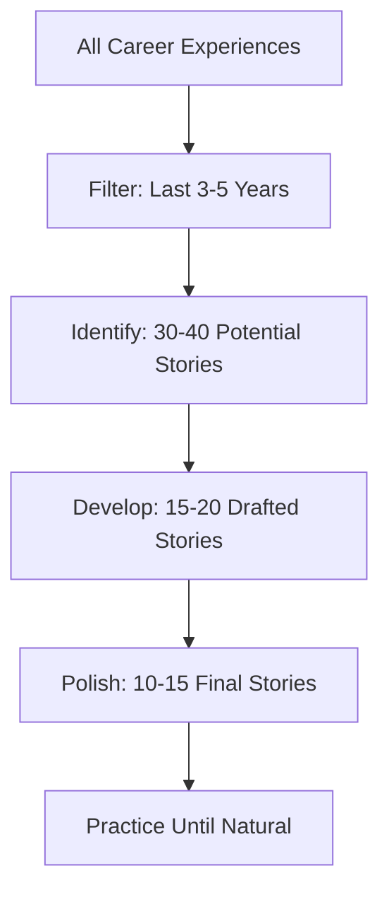
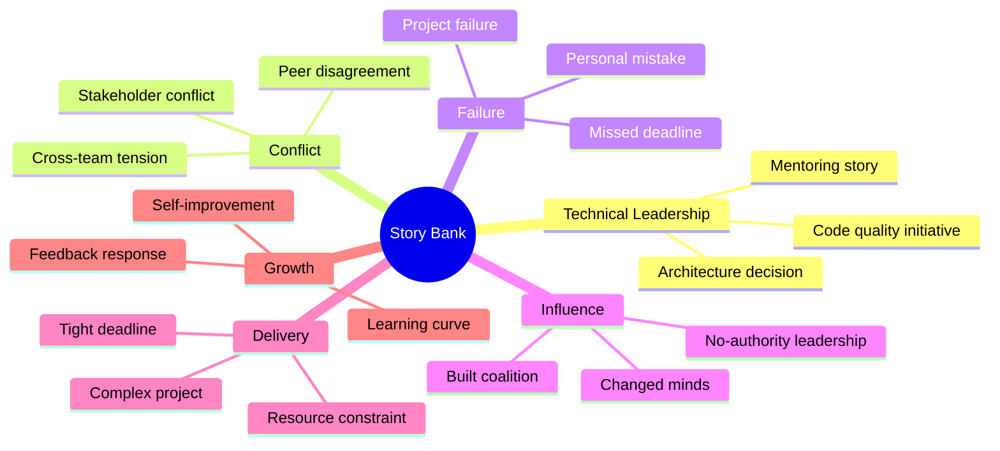

# Module 2: Story Mining & Preparation

## Learning Objectives

By the end of this module, learners will be able to:
1. Systematically mine experiences for interview stories
2. Create a categorized story matrix covering all question types
3. Write and refine 10-15 polished stories
4. Adapt stories for different question framings

## Core Content

### Lesson 2.1: Story Mining Process (20 minutes)

**Step 1: Career Timeline Review**
Create a timeline of your last 3-5 years:
- Projects you worked on
- Challenges you faced
- Achievements you're proud of
- Mistakes and learnings
- Key relationships and conflicts
- Times you influenced others

**Step 2: Category Brainstorm**
For each category, list 3-5 potential stories:

| Category | Potential Stories |
|----------|-------------------|
| Technical Leadership | |
| Conflict Resolution | |
| Failure & Learning | |
| Influence Without Authority | |
| Delivery Under Pressure | |
| Growth & Development | |

**Step 3: Story Selection Criteria**
Choose stories that are:
- **Recent:** Last 3-5 years
- **Resolved:** Complete with outcome
- **Impactful:** Staff-level significance
- **Specific:** Concrete details available
- **Varied:** Different contexts/challenges

### Lesson 2.2: The Story Matrix (15 minutes)

Create a matrix to track coverage:

```
         | TechLead | Conflict | Failure | Influence | Delivery | Growth
---------|----------|----------|---------|-----------|----------|-------
Story 1  |    X     |          |         |           |     X    |
Story 2  |          |    X     |         |     X     |          |
Story 3  |          |          |    X    |           |          |   X
Story 4  |    X     |    X     |         |           |          |
...
```

**Goal:** Each story covers 2-3 categories for maximum versatility.

### Lesson 2.3: Story Templates (25 minutes)

**Template for Each Story:**

```markdown
## Story Title: [Descriptive Name]

### Categories
Primary: [main category]
Secondary: [additional categories it covers]

### STAR Breakdown

**Situation** (2 sentences max):
[Context and stakes]

**Task** (2 sentences max):
[Your specific role and challenge]

**Action** (4-6 bullet points):
1. First, I...
2. Then, I...
3. Next, I...
4. Additionally, I...
5. Finally, I...

**Result** (2-3 sentences):
[Quantified outcome]
[What I learned]
[What I'd do differently - optional]

### Potential Follow-ups
- What would you do differently?
- How did others react?
- What was the hardest part?

### Company Alignment
- [Company A]: Maps to [value/principle]
- [Company B]: Maps to [value/principle]
```

### Lesson 2.4: Quantifying Impact (15 minutes)

**When you have metrics:**
- "Reduced load time by 40%"
- "Increased conversion by 15%"
- "Saved $200K annually"
- "Reduced incidents from 5/month to 1/quarter"

**When you don't have metrics:**
- Scale: "Affected 10,000 daily users"
- Comparison: "Cut processing time in half"
- Qualitative: "Received commendation from VP"
- Team impact: "Approach adopted by 3 other teams"
- Longevity: "System still in production after 3 years"

**Estimation is OK:**
"Based on our user metrics, this change likely improved satisfaction scores by about 15-20%"

### Lesson 2.5: Story Versatility (15 minutes)

**The same story can answer different questions:**

**Example Story:** Led migration from monolith to microservices

- **Technical Leadership:** "Tell me about a technical decision you drove"
  → Focus on architecture analysis, trade-off evaluation, decision process

- **Influence:** "How have you influenced without authority?"
  → Focus on getting buy-in from reluctant teams, building coalition

- **Delivery:** "Tell me about a complex project"
  → Focus on planning, risk management, execution

- **Failure:** "Tell me about a project that didn't go as planned"
  → Focus on challenges, what went wrong, recovery

**Adaptation technique:**
- Keep situation/task similar
- Emphasize different actions
- Tailor result to question focus

## Interactive Elements

### Self-Check Quiz

1. How many core stories should you prepare?
   - [ ] 5-7
   - [x] 10-15
   - [ ] 20-25
   - [ ] 3-5

2. What timeframe should stories come from?
   - [ ] Entire career
   - [ ] Current job only
   - [x] Last 3-5 years
   - [ ] Last year only

3. What makes a story versatile?
   - [ ] Being very long with many details
   - [x] Covering multiple categories
   - [ ] Being from a famous company
   - [ ] Having dramatic elements

### Story Mining Exercise

Complete this for YOUR experience:

**Last 3 Years - Key Events:**
1. Biggest technical challenge: _______________
2. Most significant achievement: _______________
3. Hardest conflict to resolve: _______________
4. Biggest mistake/learning: _______________
5. Time you influenced a decision: _______________
6. Project delivered under pressure: _______________

### Story Writing Practice

**Write one complete story using the template:**

Story Title: _______________

Categories: Primary: _______________ Secondary: _______________

STAR:
- Situation: _______________
- Task: _______________
- Action (bullets):
  1. _______________
  2. _______________
  3. _______________
  4. _______________
- Result: _______________

## Visual Components

### Story Development Funnel


### Category Coverage Map


## Common Pitfalls

| Pitfall | Problem | Solution |
|---------|---------|----------|
| Too few stories | Can't adapt to questions | Mine for 15+ stories |
| All from same context | Limited versatility | Include varied situations |
| Only successes | Missing failure questions | Include 2-3 failures |
| Overly detailed | Hard to remember | Focus on key points |
| Not practiced | Sounds rehearsed or rambling | Practice aloud repeatedly |

## Practice Schedule

**Week 1:**
- Day 1-2: Mine 30+ potential stories
- Day 3-4: Select and outline 15 best
- Day 5-7: Write full STAR for first 7

**Week 2:**
- Day 1-3: Write full STAR for remaining 8
- Day 4-5: Create story matrix
- Day 6-7: First practice session (all stories)

**Week 3:**
- Refine based on practice
- Practice each story 3+ times
- Get feedback from peer

## Key Points Summary

1. **Mine systematically** - timeline review + category brainstorm
2. **Aim for 10-15 stories** - covering all categories
3. **Each story should cover 2-3 categories** - maximize versatility
4. **Quantify results** - find or estimate metrics
5. **Practice adaptation** - same story, different angles
6. **Document in templates** - for easy review and practice

## Next Steps

With your story bank prepared, proceed to Module 3: Technical Leadership Stories to deepen your technical leadership narratives.
