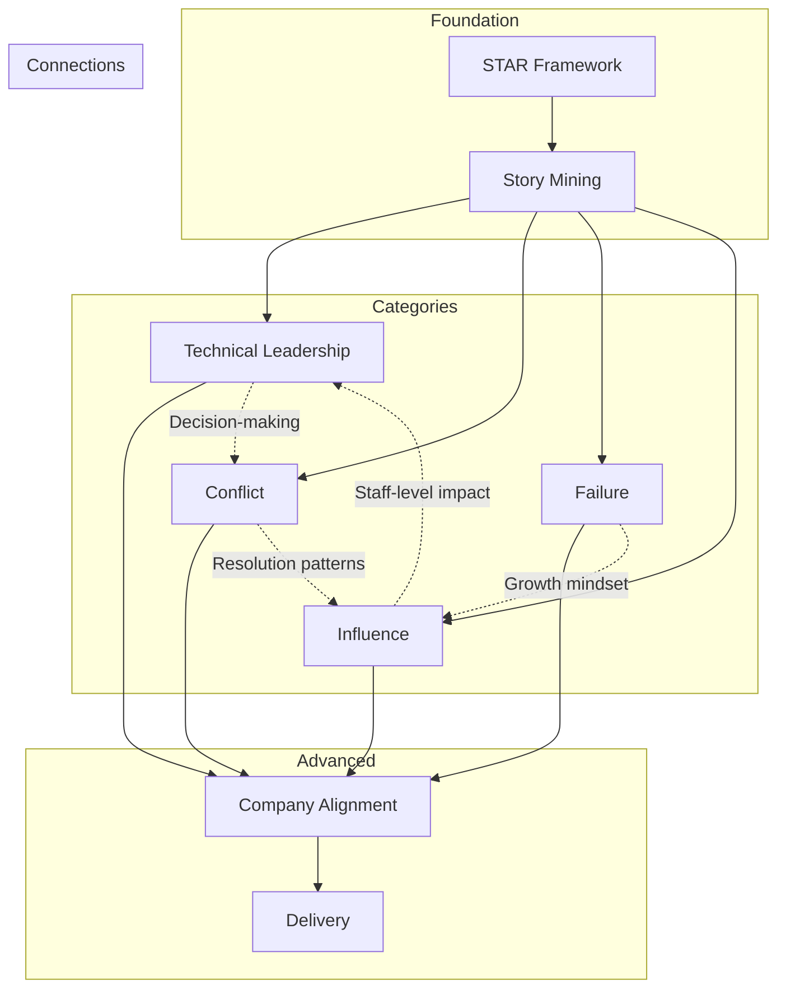

# Behavioral Rounds - Retention Strategy

## Spaced Repetition Schedule

### Week 1: Foundation Phase
| Day | Review Topic | Duration |
|-----|--------------|----------|
| 1 | STAR framework structure | 15 min |
| 2 | Time allocation rules | 10 min |
| 3 | Common STAR mistakes | 15 min |
| 4 | Story selection criteria | 15 min |
| 5 | Practice 2 stories aloud | 20 min |
| 6 | Review + quiz | 20 min |
| 7 | REST | - |

### Week 2: Category Phase
| Day | Review Topic | Duration |
|-----|--------------|----------|
| 1 | Technical leadership patterns | 20 min |
| 2 | Conflict resolution frameworks | 20 min |
| 3 | Failure story guidelines | 15 min |
| 4 | Influence tactics | 20 min |
| 5 | Practice 3 stories aloud | 30 min |
| 6 | Review all frameworks | 25 min |
| 7 | REST | - |

### Week 3: Integration Phase
| Day | Review Topic | Duration |
|-----|--------------|----------|
| 1 | Review STAR + practice | 20 min |
| 2 | Company value mapping | 25 min |
| 3 | Follow-up question handling | 15 min |
| 4 | Practice 4 stories aloud | 30 min |
| 5 | Mock interview (30 min) | 30 min |
| 6 | Review feedback + adjust | 20 min |
| 7 | REST | - |

### Week 4+: Maintenance Phase
| Frequency | Activity | Duration |
|-----------|----------|----------|
| Daily | Review 1 story | 5 min |
| 2x/week | Practice aloud | 15 min |
| Weekly | Full framework review | 20 min |
| Bi-weekly | Mock interview | 45 min |

---

## Key Concepts to Review

### Weekly Review (Essential)

#### STAR Framework
- [ ] Situation: 15% (context, stakes)
- [ ] Task: 15% (your role, challenge)
- [ ] Action: 50% (specific "I" actions)
- [ ] Result: 20% (quantified + learning)

#### Time Management
- [ ] Target: 2-3 minutes per response
- [ ] Pause before answering (1-2 seconds)
- [ ] Watch interviewer engagement

#### Story Requirements
- [ ] Recent (3-5 years)
- [ ] Resolved (not ongoing)
- [ ] Specific (not hypothetical)
- [ ] Impactful (staff-level)

### Monthly Review (Frameworks)

#### Influence Tactics (in order of effectiveness)
1. Shared goals
2. Data & evidence
3. Expert credibility
4. Relationships
5. Coalition building
6. Escalation (last resort)

#### Conflict Resolution Steps
1. Acknowledge the conflict
2. Understand other perspective
3. Separate people from problem
4. Focus on interests
5. Find mutual solution
6. Maintain relationship

#### Failure Response Framework
1. Own it (no excuses)
2. Brief context
3. Impact description
4. Reflection & learning
5. Changes made
6. Application since

### Pre-Interview Review (Day Before)

- [ ] Target company values
- [ ] Stories mapped to values
- [ ] 3 most likely questions
- [ ] Your questions for them
- [ ] Logistics confirmed

---

## Progressive Difficulty Increases

### Level 1: Basics (Week 1-2)
- Simple STAR responses
- Single-category questions
- Prepared stories only
- No follow-ups

### Level 2: Intermediate (Week 3-4)
- Multi-faceted questions
- Category combinations
- Basic follow-up handling
- Time pressure (2-3 min limit)

### Level 3: Advanced (Week 5+)
- Ambiguous questions
- Rapid category switching
- Deep follow-up probing
- Company-specific framing
- Stress conditions

---

## Connection Maps Between Modules



### Cross-Module Concepts

| Concept | Appears In | Connection |
|---------|------------|------------|
| "I" language | M1, M3-M6 | All stories need clear ownership |
| Quantified results | M1, M2, M3-M5 | Every story needs measurable outcomes |
| Learning emphasis | M1, M5, M6 | Growth mindset threads through all |
| Stakeholder awareness | M4, M6, M7 | Understanding others' perspectives |
| Trade-off thinking | M3, M6 | Technical and influence decisions |

---

## Story Maintenance Protocol

### Weekly Story Check
1. Pick 3 stories randomly
2. Recite STAR for each (aloud)
3. Check against written version
4. Note any drift or improvement

### Monthly Story Refresh
1. Review all stories for relevance
2. Add new experiences
3. Retire dated stories
4. Update metrics if available

### Pre-Interview Story Prep
1. Select 10 most relevant stories
2. Map to company values
3. Practice each once aloud
4. Prepare 3 backup stories

---

## Practice Schedule Templates

### Light Maintenance (15 min/day)
- Mon: Review 2 stories silently
- Tue: Practice 1 story aloud
- Wed: Review framework cards
- Thu: Practice 1 story aloud
- Fri: Review company values

### Active Preparation (45 min/day)
- Mon: Practice 3 stories + review framework
- Tue: Mock interview questions + feedback
- Wed: Review + refine stories based on feedback
- Thu: Practice 3 different stories
- Fri: Company research + value mapping
- Sat: Full mock interview
- Sun: Rest + light review

### Intensive Prep (2 hours/day)
- Morning (1 hr): Framework review + story practice
- Afternoon (1 hr): Mock interview or peer practice
- Evening (30 min): Review and refinement
- Repeat with different focus areas

---

## Memory Techniques

### For STAR Structure
**Mnemonic:** "Start Talking About Results"
- **S**tart with context
- **T**alking about your role
- **A**bout what you did
- **R**esults and learning

### For Time Allocation
**Visual:** Think of a pie chart
- Thin slices: Situation (15%) + Task (15%)
- Big slice: Action (50%)
- Medium slice: Result (20%)

### For Influence Tactics
**Mnemonic:** "SDERC" (pronounced "sederk")
- **S**hared goals
- **D**ata/evidence
- **E**xpert credibility
- **R**elationships
- **C**oalition building

### For Failure Framework
**Mnemonic:** "OWLIC" (Own, What happened, Learning, Impact, Change)

---

## Self-Assessment Checkpoints

### After 1 Week
- [ ] Can recite STAR structure from memory
- [ ] Have 5 stories drafted
- [ ] Practiced each story at least once
- [ ] Understand time allocation

### After 2 Weeks
- [ ] Have 10 stories drafted
- [ ] Each story covers at least 2 categories
- [ ] Can deliver stories in 2-3 minutes
- [ ] Know conflict resolution framework

### After 3 Weeks
- [ ] Have 15 stories drafted
- [ ] Know influence tactics hierarchy
- [ ] Can handle basic follow-ups
- [ ] Completed at least 1 mock interview

### After 4 Weeks
- [ ] All stories company-aligned
- [ ] Stories feel natural (not memorized)
- [ ] Can handle deep follow-ups
- [ ] Completed 3+ mock interviews
- [ ] Received and incorporated feedback

---

## Quick Reference Cards

### Card 1: STAR Timing
```
S: 15-20 sec | T: 15-20 sec | A: 60-75 sec | R: 20-30 sec
Total: 2-3 minutes
```

### Card 2: Story Checklist
```
[ ] Recent (3-5 years)
[ ] Specific (not hypothetical)
[ ] "I" language (not "we")
[ ] Quantified result
[ ] Learning included
```

### Card 3: Follow-up Responses
```
"What else?" → Add depth to Action
"What would you do differently?" → Show growth
"How did others react?" → Show awareness
"What did you learn?" → Emphasize reflection
```

### Card 4: Recovery Phrases
```
"Let me give you a better example..."
"To add to that..."
"The key thing I'd emphasize is..."
"Actually, a more relevant story would be..."
```

---

## Accountability Tools

### Practice Log Template
| Date | Stories Practiced | Duration | Notes |
|------|-------------------|----------|-------|
| | | | |

### Mock Interview Tracker
| Date | Partner | Questions | Score (1-5) | Key Feedback |
|------|---------|-----------|-------------|--------------|
| | | | | |

### Improvement Tracker
| Week | Strength Developed | Area to Improve |
|------|-------------------|-----------------|
| 1 | | |
| 2 | | |
| 3 | | |
| 4 | | |
