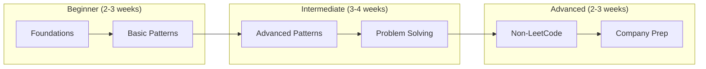
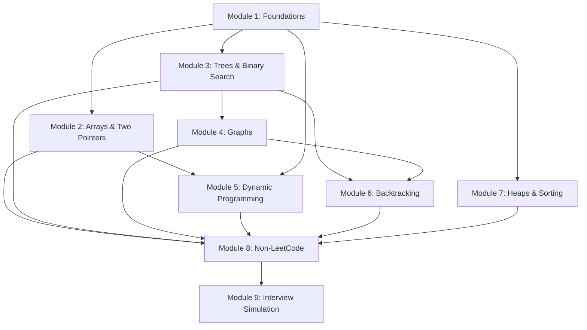

# Course Structure for Coding Rounds

## Learning Path

## Prerequisites

- Basic programming proficiency in at least one language (Python, Java, or JavaScript recommended)
- Understanding of basic data types and control structures
- Familiarity with object-oriented programming concepts
- Ability to write and run code locally or in an online IDE

## Total Estimated Commitment

- **Study time**: 80-120 hours over 8-10 weeks
- **Practice problems**: 100-150 problems
- **Mock interviews**: 4-6 sessions

## Modules Overview

### Module 1: Foundations & Complexity Analysis
- **Duration**: 8-10 hours
- **Learning objectives**:
  - Understand Big-O notation and complexity analysis
  - Review core data structures (arrays, linked lists, stacks, queues)
  - Master hash tables and their applications
- **Key concepts**: Time/space complexity, amortized analysis, hash collisions
- **Dependencies**: None

### Module 2: Arrays, Strings & Two Pointers
- **Duration**: 10-12 hours
- **Learning objectives**:
  - Master two-pointer techniques
  - Understand sliding window pattern
  - Apply prefix sum optimization
- **Key concepts**: Two pointers, sliding window, prefix arrays
- **Dependencies**: Module 1

### Module 3: Trees & Binary Search
- **Duration**: 10-12 hours
- **Learning objectives**:
  - Implement tree traversals (pre, in, post, level-order)
  - Master binary search variations
  - Understand BST operations
- **Key concepts**: DFS, BFS, binary search boundaries
- **Dependencies**: Module 1

### Module 4: Graphs & Advanced Traversal
- **Duration**: 12-15 hours
- **Learning objectives**:
  - Implement graph representations
  - Master DFS/BFS in graphs
  - Apply topological sort and Union-Find
- **Key concepts**: Adjacency list/matrix, cycle detection, connected components
- **Dependencies**: Module 3

### Module 5: Dynamic Programming
- **Duration**: 15-18 hours
- **Learning objectives**:
  - Identify DP problems
  - Implement memoization and tabulation
  - Solve classic DP patterns
- **Key concepts**: Overlapping subproblems, optimal substructure, state design
- **Dependencies**: Module 1, 2

### Module 6: Backtracking & Recursion
- **Duration**: 8-10 hours
- **Learning objectives**:
  - Implement backtracking template
  - Generate permutations and combinations
  - Solve constraint satisfaction problems
- **Key concepts**: State space tree, pruning, choice/explore/unchoose
- **Dependencies**: Module 3, 4

### Module 7: Heaps, Priority Queues & Sorting
- **Duration**: 8-10 hours
- **Learning objectives**:
  - Implement heap operations
  - Apply heap to Top-K problems
  - Understand sorting algorithm trade-offs
- **Key concepts**: Heap property, heapify, custom comparators
- **Dependencies**: Module 1

### Module 8: Non-LeetCode Practical Problems
- **Duration**: 15-20 hours
- **Learning objectives**:
  - Build production-quality implementations
  - Design clean APIs
  - Write comprehensive tests
- **Key concepts**: LRU Cache, parsers, schedulers, concurrent data structures
- **Dependencies**: Modules 1-7

### Module 9: Interview Simulation & Communication
- **Duration**: 10-15 hours
- **Learning objectives**:
  - Practice thinking aloud
  - Handle ambiguity gracefully
  - Manage time effectively
- **Key concepts**: UMPIRE method, communication patterns, debugging strategies
- **Dependencies**: All previous modules

## Module Dependency Graph

## Weekly Study Plan (Recommended)

### Week 1-2: Foundations
- Complete Module 1
- Start Module 2 (Two Pointers section)
- Daily: 3-4 easy problems

### Week 3-4: Core Patterns
- Complete Module 2
- Complete Module 3
- Daily: 2-3 medium problems

### Week 5-6: Advanced Patterns
- Complete Module 4
- Complete Module 5 (DP introduction)
- Daily: 2 medium problems

### Week 7-8: Specialized Topics
- Complete Module 5 (DP advanced)
- Complete Modules 6 and 7
- Daily: 1-2 medium/hard problems

### Week 9-10: Staff-Level Prep
- Complete Module 8
- Complete Module 9
- Schedule mock interviews
- Review weak areas

## Assessment Checkpoints

| Checkpoint | After Module | Requirements |
|------------|--------------|--------------|
| Checkpoint 1 | Module 3 | Solve 2 medium problems in 45 min |
| Checkpoint 2 | Module 5 | Explain DP approach for new problem |
| Checkpoint 3 | Module 7 | Complete Blind75 easy/medium |
| Checkpoint 4 | Module 8 | Build LRU Cache from scratch |
| Final | Module 9 | Pass mock interview |

## Success Criteria

By completing this course, you should be able to:

1. **Solve 80%+ of LeetCode medium problems** within 30-40 minutes
2. **Identify problem patterns** within the first 2-3 minutes
3. **Write clean, production-quality code** under interview pressure
4. **Build non-LeetCode systems** like caches and parsers
5. **Communicate your approach** clearly throughout the interview
6. **Handle follow-up questions** about optimization and alternatives
