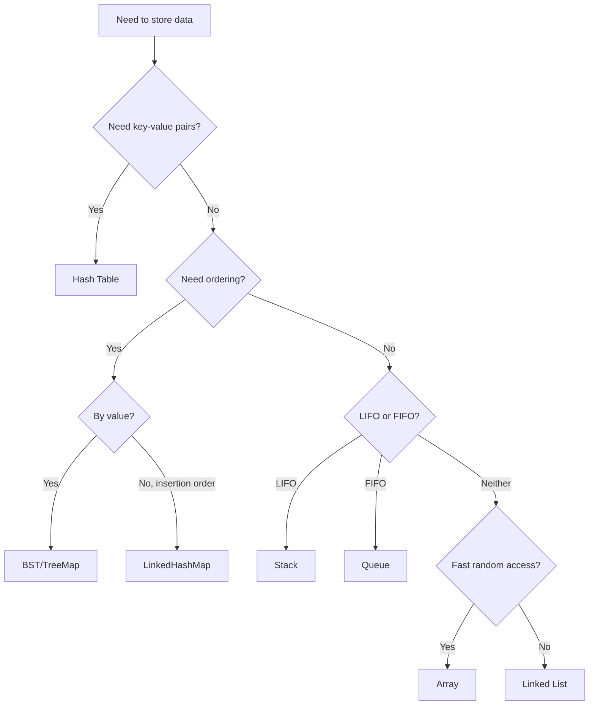

# Module 1: Foundations & Complexity Analysis

## Learning Objectives

By the end of this module, you will be able to:

1. Analyze time and space complexity using Big-O notation
2. Choose appropriate data structures based on operation requirements
3. Implement and use fundamental data structures confidently
4. Recognize when to apply amortized analysis

## Core Content

### Lesson 1.1: Big-O Notation (1.5 hours)

#### Concepts
- **Definition**: Big-O describes the upper bound of algorithm growth rate
- **Common complexities**: O(1), O(log n), O(n), O(n log n), O(n²), O(2ⁿ)
- **Rules**:
  - Drop constants: O(2n) → O(n)
  - Drop lower-order terms: O(n² + n) → O(n²)
  - Different inputs use different variables

#### Visual: Complexity Growth Comparison

```
Operations
│
│                                    * O(2^n)
│                               *
│                          *
│                     *
│                *              * O(n²)
│           *              *
│       *            *
│    *         *
│  *      *         * O(n log n)
│ *   *       *
│*  *    *       * O(n)
│* *  *     *
│**  *   *    * O(log n)
│* *  *  *  *  *
│*  * * * * * * * O(1)
└──────────────────────────── n
```

#### Practice
1. What is the time complexity of nested loops iterating n and m times?
2. What is the space complexity of a recursive function with depth n?

### Lesson 1.2: Arrays & Linked Lists (2 hours)

#### Arrays
- **Strengths**: O(1) random access, cache-friendly
- **Weaknesses**: O(n) insertion/deletion (middle), fixed size (static arrays)
- **Use when**: Need fast random access, known size

```python
# Array operations complexity
arr = [1, 2, 3, 4, 5]
arr[2]           # O(1) - access
arr.append(6)    # O(1) amortized - append
arr.insert(0, 0) # O(n) - insert at beginning
arr.pop()        # O(1) - remove from end
arr.pop(0)       # O(n) - remove from beginning
```

#### Linked Lists
- **Strengths**: O(1) insertion/deletion (with reference)
- **Weaknesses**: O(n) random access, extra memory for pointers
- **Use when**: Frequent insertions/deletions, unknown size

```python
class ListNode:
    def __init__(self, val=0, next=None):
        self.val = val
        self.next = next

# Linked list operations
# Insert at head: O(1)
# Insert at tail (with tail pointer): O(1)
# Insert at position: O(n)
# Delete (with reference): O(1)
# Search: O(n)
```

### Lesson 1.3: Stacks & Queues (1.5 hours)

#### Stacks (LIFO)
- **Operations**: push, pop, peek - all O(1)
- **Use cases**: Expression evaluation, backtracking, DFS, undo operations

```python
# Stack implementation
stack = []
stack.append(1)  # push
stack.pop()      # pop
stack[-1]        # peek

# Common pattern: Matching parentheses
def is_valid(s):
    stack = []
    mapping = {')': '(', '}': '{', ']': '['}

    for char in s:
        if char in mapping:
            if not stack or stack.pop() != mapping[char]:
                return False
        else:
            stack.append(char)

    return len(stack) == 0
```

#### Queues (FIFO)
- **Operations**: enqueue, dequeue, front - all O(1)
- **Use cases**: BFS, scheduling, buffering

```python
from collections import deque

# Queue implementation
queue = deque()
queue.append(1)     # enqueue
queue.popleft()     # dequeue
queue[0]            # front
```

### Lesson 1.4: Hash Tables (2 hours)

#### Core Concepts
- **Hash function**: Maps keys to array indices
- **Collision handling**: Chaining or open addressing
- **Load factor**: ratio of elements to buckets

```python
# Hash table operations (average case)
d = {}
d[key] = value    # O(1) insert
d[key]            # O(1) lookup
del d[key]        # O(1) delete
key in d          # O(1) membership
```

#### Common Patterns

```python
# Frequency counting
from collections import Counter
freq = Counter(arr)  # O(n)

# Two Sum pattern
def two_sum(nums, target):
    seen = {}
    for i, num in enumerate(nums):
        complement = target - num
        if complement in seen:
            return [seen[complement], i]
        seen[num] = i
    return []

# Grouping by key
from collections import defaultdict
groups = defaultdict(list)
for item in items:
    groups[get_key(item)].append(item)
```

### Lesson 1.5: Trees Basics (1.5 hours)

#### Binary Tree Structure
```python
class TreeNode:
    def __init__(self, val=0, left=None, right=None):
        self.val = val
        self.left = left
        self.right = right
```

#### Tree Properties
- **Height**: Longest path from root to leaf
- **Depth**: Distance from root to node
- **Balanced**: Height difference between subtrees ≤ 1
- **Complete**: All levels filled except possibly last (left-aligned)

#### BST Property
- Left subtree values < node value
- Right subtree values > node value
- Enables O(log n) search in balanced trees

## Interactive Elements

### Self-Check Questions

1. **Question**: An algorithm has nested loops where the outer runs n times and inner runs n times. What is its time complexity?
   - [ ] O(n)
   - [x] O(n²)
   - [ ] O(2n)
   - [ ] O(n + n)

2. **Question**: Which data structure gives O(1) access and O(1) insertion at the end?
   - [x] Dynamic Array
   - [ ] Linked List
   - [ ] Stack
   - [ ] Queue

3. **Question**: What is the worst-case time complexity for hash table lookup?
   - [ ] O(1)
   - [ ] O(log n)
   - [x] O(n)
   - [ ] O(n²)

### Practice Problems

**Easy**:
1. Valid Parentheses (LeetCode #20)
2. Two Sum (LeetCode #1)
3. Reverse Linked List (LeetCode #206)

**Medium**:
1. LRU Cache (LeetCode #146)
2. Group Anagrams (LeetCode #49)
3. Add Two Numbers (LeetCode #2)

## Visual Components

### Data Structure Decision Tree



## Spaced Repetition Points

Review these concepts at intervals:

| Concept | Day 1 | Day 3 | Day 7 | Day 14 |
|---------|-------|-------|-------|--------|
| Big-O rules | ☐ | ☐ | ☐ | ☐ |
| Array vs Linked List trade-offs | ☐ | ☐ | ☐ | ☐ |
| Hash table collision handling | ☐ | ☐ | ☐ | ☐ |
| BST property | ☐ | ☐ | ☐ | ☐ |

## Common Pitfalls

1. **Forgetting about worst case**: Hash tables are O(n) worst case
2. **Ignoring space complexity**: Recursive calls use stack space
3. **Off-by-one errors**: Array bounds and loop conditions
4. **Modifying during iteration**: Don't modify collections while iterating

## Real-World Applications

- **Arrays**: Image pixel data, time series data
- **Linked Lists**: Browser history, memory allocation
- **Stacks**: Call stack, expression evaluation, undo/redo
- **Queues**: Task scheduling, message queues, BFS
- **Hash Tables**: Caching, indexing, de-duplication
