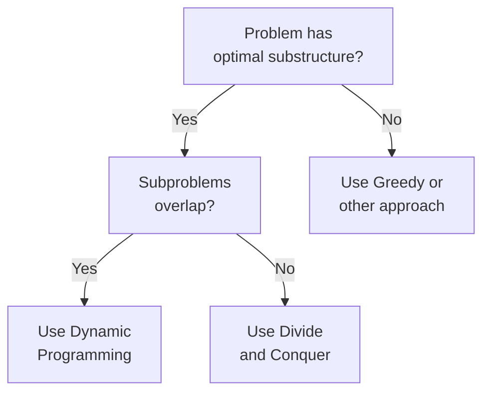
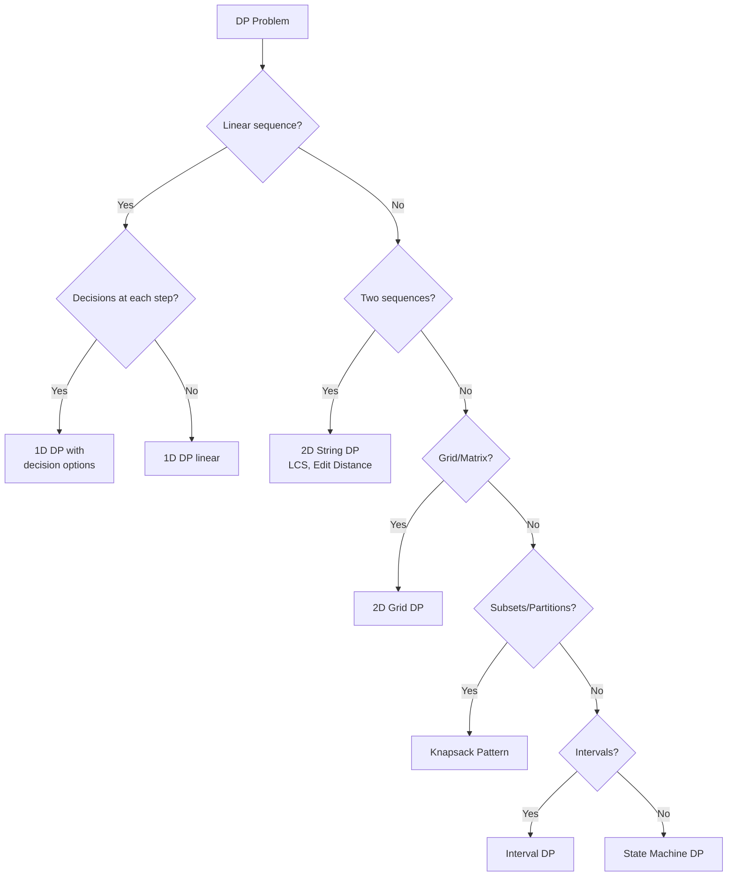

# Module 5: Dynamic Programming

## Learning Objectives

By the end of this module, you will be able to:

1. Identify when a problem can be solved with dynamic programming
2. Design state representations for DP problems
3. Implement both top-down (memoization) and bottom-up (tabulation) approaches
4. Optimize space complexity in DP solutions
5. Recognize and apply common DP patterns

## Core Content

### Lesson 5.1: Introduction to DP (2 hours)

#### What is Dynamic Programming?

DP is an optimization technique for problems with:
1. **Overlapping Subproblems**: Same subproblems are solved multiple times
2. **Optimal Substructure**: Optimal solution can be built from optimal solutions to subproblems



#### Fibonacci Example

```python
# Naive recursive - O(2^n) time
def fib_naive(n):
    if n <= 1:
        return n
    return fib_naive(n-1) + fib_naive(n-2)

# Memoization (top-down) - O(n) time, O(n) space
def fib_memo(n, memo={}):
    if n in memo:
        return memo[n]
    if n <= 1:
        return n
    memo[n] = fib_memo(n-1, memo) + fib_memo(n-2, memo)
    return memo[n]

# Tabulation (bottom-up) - O(n) time, O(n) space
def fib_tab(n):
    if n <= 1:
        return n
    dp = [0] * (n + 1)
    dp[1] = 1
    for i in range(2, n + 1):
        dp[i] = dp[i-1] + dp[i-2]
    return dp[n]

# Space-optimized - O(n) time, O(1) space
def fib_optimized(n):
    if n <= 1:
        return n
    prev2, prev1 = 0, 1
    for _ in range(2, n + 1):
        curr = prev1 + prev2
        prev2, prev1 = prev1, curr
    return prev1
```

### Lesson 5.2: 1D Dynamic Programming (3 hours)

#### Pattern: Linear Sequence DP

State: `dp[i]` = answer for first i elements or ending at index i

```python
# Climbing Stairs: Ways to reach step n (1 or 2 steps at a time)
def climb_stairs(n):
    if n <= 2:
        return n
    dp = [0] * (n + 1)
    dp[1], dp[2] = 1, 2
    for i in range(3, n + 1):
        dp[i] = dp[i-1] + dp[i-2]
    return dp[n]

# House Robber: Max value without robbing adjacent houses
def rob(nums):
    if not nums:
        return 0
    if len(nums) == 1:
        return nums[0]

    dp = [0] * len(nums)
    dp[0] = nums[0]
    dp[1] = max(nums[0], nums[1])

    for i in range(2, len(nums)):
        dp[i] = max(dp[i-1], dp[i-2] + nums[i])

    return dp[-1]
```

#### Pattern: Decision at Each Step

```python
# Best Time to Buy and Sell Stock
def max_profit(prices):
    if not prices:
        return 0

    min_price = prices[0]
    max_profit = 0

    for price in prices[1:]:
        max_profit = max(max_profit, price - min_price)
        min_price = min(min_price, price)

    return max_profit

# Maximum Subarray (Kadane's Algorithm)
def max_subarray(nums):
    max_sum = current_sum = nums[0]

    for num in nums[1:]:
        current_sum = max(num, current_sum + num)
        max_sum = max(max_sum, current_sum)

    return max_sum
```

### Lesson 5.3: 2D Dynamic Programming (4 hours)

#### Pattern: Grid DP

State: `dp[i][j]` = answer for subproblem at position (i, j)

```python
# Unique Paths: Count paths from top-left to bottom-right
def unique_paths(m, n):
    dp = [[1] * n for _ in range(m)]

    for i in range(1, m):
        for j in range(1, n):
            dp[i][j] = dp[i-1][j] + dp[i][j-1]

    return dp[m-1][n-1]

# Minimum Path Sum
def min_path_sum(grid):
    m, n = len(grid), len(grid[0])
    dp = [[0] * n for _ in range(m)]
    dp[0][0] = grid[0][0]

    # Fill first row
    for j in range(1, n):
        dp[0][j] = dp[0][j-1] + grid[0][j]

    # Fill first column
    for i in range(1, m):
        dp[i][0] = dp[i-1][0] + grid[i][0]

    # Fill rest
    for i in range(1, m):
        for j in range(1, n):
            dp[i][j] = min(dp[i-1][j], dp[i][j-1]) + grid[i][j]

    return dp[m-1][n-1]
```

#### Pattern: String DP

```python
# Longest Common Subsequence
def lcs(text1, text2):
    m, n = len(text1), len(text2)
    dp = [[0] * (n + 1) for _ in range(m + 1)]

    for i in range(1, m + 1):
        for j in range(1, n + 1):
            if text1[i-1] == text2[j-1]:
                dp[i][j] = dp[i-1][j-1] + 1
            else:
                dp[i][j] = max(dp[i-1][j], dp[i][j-1])

    return dp[m][n]

# Edit Distance (Levenshtein)
def edit_distance(word1, word2):
    m, n = len(word1), len(word2)
    dp = [[0] * (n + 1) for _ in range(m + 1)]

    # Base cases
    for i in range(m + 1):
        dp[i][0] = i
    for j in range(n + 1):
        dp[0][j] = j

    for i in range(1, m + 1):
        for j in range(1, n + 1):
            if word1[i-1] == word2[j-1]:
                dp[i][j] = dp[i-1][j-1]
            else:
                dp[i][j] = 1 + min(
                    dp[i-1][j],    # delete
                    dp[i][j-1],    # insert
                    dp[i-1][j-1]   # replace
                )

    return dp[m][n]
```

### Lesson 5.4: Classic DP Problems (4 hours)

#### Knapsack Pattern

```python
# 0/1 Knapsack: Each item can be used at most once
def knapsack_01(weights, values, capacity):
    n = len(weights)
    dp = [[0] * (capacity + 1) for _ in range(n + 1)]

    for i in range(1, n + 1):
        for w in range(capacity + 1):
            # Don't take item i
            dp[i][w] = dp[i-1][w]
            # Take item i (if it fits)
            if weights[i-1] <= w:
                dp[i][w] = max(
                    dp[i][w],
                    dp[i-1][w - weights[i-1]] + values[i-1]
                )

    return dp[n][capacity]

# Unbounded Knapsack: Items can be used unlimited times
def knapsack_unbounded(weights, values, capacity):
    dp = [0] * (capacity + 1)

    for w in range(1, capacity + 1):
        for i in range(len(weights)):
            if weights[i] <= w:
                dp[w] = max(dp[w], dp[w - weights[i]] + values[i])

    return dp[capacity]

# Coin Change: Minimum coins to make amount
def coin_change(coins, amount):
    dp = [float('inf')] * (amount + 1)
    dp[0] = 0

    for a in range(1, amount + 1):
        for coin in coins:
            if coin <= a and dp[a - coin] != float('inf'):
                dp[a] = min(dp[a], dp[a - coin] + 1)

    return dp[amount] if dp[amount] != float('inf') else -1
```

#### Partition Pattern

```python
# Partition Equal Subset Sum
def can_partition(nums):
    total = sum(nums)
    if total % 2 != 0:
        return False

    target = total // 2
    dp = [False] * (target + 1)
    dp[0] = True

    for num in nums:
        for j in range(target, num - 1, -1):
            dp[j] = dp[j] or dp[j - num]

    return dp[target]
```

### Lesson 5.5: Advanced DP Techniques (3 hours)

#### State Machine DP

```python
# Best Time to Buy and Sell Stock with Cooldown
def max_profit_cooldown(prices):
    if len(prices) < 2:
        return 0

    # States: hold, sold, rest
    hold = -prices[0]
    sold = 0
    rest = 0

    for price in prices[1:]:
        prev_hold = hold
        prev_sold = sold

        hold = max(hold, rest - price)      # Buy or keep holding
        sold = prev_hold + price            # Sell
        rest = max(rest, prev_sold)         # Rest after sold

    return max(sold, rest)

# Stock with Transaction Fee
def max_profit_fee(prices, fee):
    hold = -prices[0]
    cash = 0

    for price in prices[1:]:
        hold = max(hold, cash - price)
        cash = max(cash, hold + price - fee)

    return cash
```

#### Interval DP

```python
# Longest Palindromic Subsequence
def longest_palindrome_subseq(s):
    n = len(s)
    dp = [[0] * n for _ in range(n)]

    # Base case: single characters
    for i in range(n):
        dp[i][i] = 1

    # Fill diagonally
    for length in range(2, n + 1):
        for i in range(n - length + 1):
            j = i + length - 1
            if s[i] == s[j]:
                dp[i][j] = dp[i+1][j-1] + 2
            else:
                dp[i][j] = max(dp[i+1][j], dp[i][j-1])

    return dp[0][n-1]
```

## Interactive Elements

### Self-Check Questions

1. **Question**: What are the two properties required for a DP solution?
   - [x] Overlapping subproblems and optimal substructure
   - [ ] Sorted input and unique elements
   - [ ] Binary decisions and linear time
   - [ ] Graph structure and weighted edges

2. **Question**: What is the time complexity of the 2D DP solution for LCS?
   - [ ] O(n)
   - [ ] O(n log n)
   - [x] O(m × n)
   - [ ] O(2^n)

3. **Question**: When should you use tabulation over memoization?
   - [ ] When recursion depth might cause stack overflow
   - [ ] When you need to solve all subproblems anyway
   - [ ] When iterative solution is more natural
   - [x] All of the above

### Practice Problems

**Easy**:
1. Climbing Stairs (LeetCode #70)
2. House Robber (LeetCode #198)
3. Maximum Subarray (LeetCode #53)

**Medium**:
1. Coin Change (LeetCode #322)
2. Longest Increasing Subsequence (LeetCode #300)
3. Unique Paths (LeetCode #62)
4. Word Break (LeetCode #139)

**Hard**:
1. Edit Distance (LeetCode #72)
2. Regular Expression Matching (LeetCode #10)
3. Burst Balloons (LeetCode #312)

## Visual Components

### DP Pattern Recognition Flowchart



## Spaced Repetition Points

| Concept | Day 1 | Day 3 | Day 7 | Day 14 | Day 30 |
|---------|-------|-------|-------|--------|--------|
| Overlapping subproblems | ☐ | ☐ | ☐ | ☐ | ☐ |
| Memoization template | ☐ | ☐ | ☐ | ☐ | ☐ |
| Knapsack recurrence | ☐ | ☐ | ☐ | ☐ | ☐ |
| LCS recurrence | ☐ | ☐ | ☐ | ☐ | ☐ |
| Space optimization | ☐ | ☐ | ☐ | ☐ | ☐ |

## Common Pitfalls

1. **Not identifying base cases**: Always define dp[0] or dp[0][0] first
2. **Wrong iteration order**: Ensure dependencies are computed before use
3. **Off-by-one in indices**: Match loop bounds to DP array dimensions
4. **Forgetting to initialize**: DP arrays need proper initialization
5. **Not recognizing the pattern**: Practice identifying which DP type applies

## Real-World Applications

- **Resource allocation**: Knapsack for budget optimization
- **Text processing**: Edit distance for spell check, LCS for diff tools
- **Bioinformatics**: Sequence alignment using DP
- **Finance**: Portfolio optimization
- **Route planning**: Shortest path calculations
