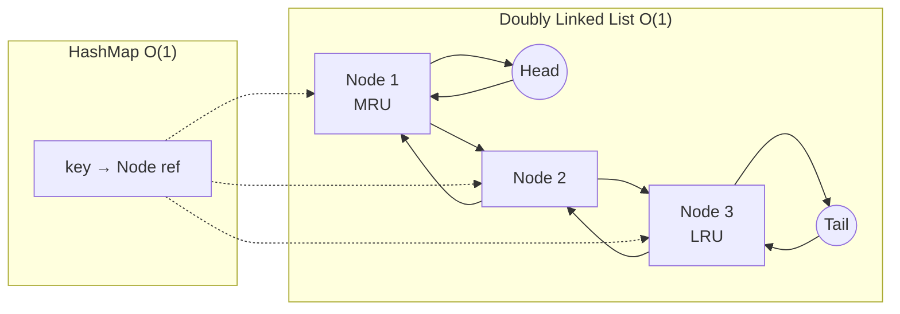

# Module 8: Non-LeetCode Practical Problems

## Learning Objectives

By the end of this module, you will be able to:

1. Design and implement production-quality data structures
2. Build systems with clean APIs and proper abstractions
3. Write comprehensive tests for your implementations
4. Handle concurrency and thread-safety requirements
5. Make and justify architectural decisions

## Core Content

### Lesson 8.1: LRU Cache Deep Dive (3 hours)

#### Design Requirements
- `get(key)`: Return value if exists, else -1. Mark as recently used.
- `put(key, value)`: Insert/update. Evict least recently used if at capacity.
- All operations must be O(1).

#### Design Decisions

```mermaid
flowchart LR
    subgraph "Data Structures"
        A[HashMap] -->|O(1) lookup| B[Value + Node Ref]
        C[Doubly Linked List] -->|O(1) remove/add| D[LRU Order]
    end
```

#### Full Implementation

```python
class Node:
    """Doubly linked list node."""
    def __init__(self, key: int = 0, val: int = 0):
        self.key = key
        self.val = val
        self.prev = None
        self.next = None


class LRUCache:
    """
    LRU Cache with O(1) get and put operations.

    Design:
    - HashMap for O(1) key lookup
    - Doubly linked list for O(1) ordering maintenance
    - Dummy head/tail nodes simplify edge cases
    """

    def __init__(self, capacity: int):
        self.capacity = capacity
        self.cache = {}  # key -> Node

        # Dummy nodes for easier list manipulation
        self.head = Node()  # Most recently used
        self.tail = Node()  # Least recently used
        self.head.next = self.tail
        self.tail.prev = self.head

    def _add_to_head(self, node: Node) -> None:
        """Add node right after head (most recent position)."""
        node.prev = self.head
        node.next = self.head.next
        self.head.next.prev = node
        self.head.next = node

    def _remove_node(self, node: Node) -> None:
        """Remove node from its current position."""
        node.prev.next = node.next
        node.next.prev = node.prev

    def _move_to_head(self, node: Node) -> None:
        """Move existing node to head (mark as recently used)."""
        self._remove_node(node)
        self._add_to_head(node)

    def _pop_tail(self) -> Node:
        """Remove and return the least recently used node."""
        lru = self.tail.prev
        self._remove_node(lru)
        return lru

    def get(self, key: int) -> int:
        """Get value for key. Returns -1 if not found."""
        if key not in self.cache:
            return -1

        node = self.cache[key]
        self._move_to_head(node)
        return node.val

    def put(self, key: int, value: int) -> None:
        """Insert or update key-value pair."""
        if key in self.cache:
            # Update existing
            node = self.cache[key]
            node.val = value
            self._move_to_head(node)
        else:
            # Insert new
            node = Node(key, value)
            self.cache[key] = node
            self._add_to_head(node)

            if len(self.cache) > self.capacity:
                # Evict LRU
                lru = self._pop_tail()
                del self.cache[lru.key]


# Comprehensive tests
def test_lru_cache():
    # Test basic operations
    cache = LRUCache(2)

    cache.put(1, 1)
    cache.put(2, 2)
    assert cache.get(1) == 1       # Returns 1

    cache.put(3, 3)                 # Evicts key 2
    assert cache.get(2) == -1      # Returns -1 (not found)

    cache.put(4, 4)                 # Evicts key 1
    assert cache.get(1) == -1      # Returns -1
    assert cache.get(3) == 3       # Returns 3
    assert cache.get(4) == 4       # Returns 4

    # Test update
    cache = LRUCache(2)
    cache.put(1, 1)
    cache.put(2, 2)
    cache.put(1, 10)                # Update, 1 becomes most recent
    cache.put(3, 3)                 # Evicts 2, not 1
    assert cache.get(2) == -1
    assert cache.get(1) == 10

    print("All LRU Cache tests passed!")

test_lru_cache()
```

### Lesson 8.2: Log Parser System (3 hours)

#### Requirements
- Parse structured log lines
- Aggregate metrics (error rates, latency percentiles)
- Support concurrent ingestion
- Query logs by time range

```python
import threading
import re
from collections import defaultdict
from datetime import datetime
from typing import List, Dict, Optional
import bisect


class LogEntry:
    """Structured log entry."""
    def __init__(self, timestamp: datetime, level: str,
                 service: str, message: str, latency_ms: Optional[int] = None):
        self.timestamp = timestamp
        self.level = level
        self.service = service
        self.message = message
        self.latency_ms = latency_ms


class LogParser:
    """
    Thread-safe log parser with metric aggregation.

    Supports:
    - Concurrent log ingestion
    - Error rate calculation by service
    - Latency percentile queries
    - Time-range queries
    """

    # Pattern: [2024-01-15T10:30:00] INFO service_name: message (latency=123ms)
    LOG_PATTERN = re.compile(
        r'^\[(?P<timestamp>[\d\-T:.]+)\]\s+'
        r'(?P<level>\w+)\s+'
        r'(?P<service>[\w_]+):\s+'
        r'(?P<message>.*?)'
        r'(?:\s+\(latency=(?P<latency>\d+)ms\))?$'
    )

    def __init__(self):
        self._lock = threading.RLock()
        self._logs: List[LogEntry] = []
        self._logs_by_time: List[tuple] = []  # (timestamp, index)
        self._service_counts: Dict[str, int] = defaultdict(int)
        self._service_errors: Dict[str, int] = defaultdict(int)
        self._service_latencies: Dict[str, List[int]] = defaultdict(list)

    def ingest(self, line: str) -> bool:
        """
        Parse and ingest a log line.
        Returns True if successful, False if parse failed.
        Thread-safe.
        """
        entry = self._parse_line(line)
        if not entry:
            return False

        with self._lock:
            idx = len(self._logs)
            self._logs.append(entry)

            # Maintain time-sorted index
            bisect.insort(self._logs_by_time, (entry.timestamp, idx))

            # Update aggregates
            self._service_counts[entry.service] += 1
            if entry.level == 'ERROR':
                self._service_errors[entry.service] += 1
            if entry.latency_ms is not None:
                bisect.insort(
                    self._service_latencies[entry.service],
                    entry.latency_ms
                )

        return True

    def _parse_line(self, line: str) -> Optional[LogEntry]:
        """Parse a single log line."""
        match = self.LOG_PATTERN.match(line.strip())
        if not match:
            return None

        latency = match.group('latency')
        return LogEntry(
            timestamp=datetime.fromisoformat(match.group('timestamp')),
            level=match.group('level'),
            service=match.group('service'),
            message=match.group('message'),
            latency_ms=int(latency) if latency else None
        )

    def get_error_rate(self, service: str) -> float:
        """Get error rate for a service (0.0 to 1.0)."""
        with self._lock:
            total = self._service_counts.get(service, 0)
            if total == 0:
                return 0.0
            errors = self._service_errors.get(service, 0)
            return errors / total

    def get_latency_percentile(self, service: str, percentile: float) -> Optional[int]:
        """
        Get latency at given percentile (0-100) for a service.
        Returns None if no latency data available.
        """
        with self._lock:
            latencies = self._service_latencies.get(service)
            if not latencies:
                return None

            idx = int(len(latencies) * percentile / 100)
            idx = min(idx, len(latencies) - 1)
            return latencies[idx]

    def query_time_range(self, start: datetime, end: datetime) -> List[LogEntry]:
        """Get all logs within time range [start, end]."""
        with self._lock:
            # Binary search for start position
            start_idx = bisect.bisect_left(
                self._logs_by_time,
                (start, -1)
            )

            result = []
            for i in range(start_idx, len(self._logs_by_time)):
                ts, log_idx = self._logs_by_time[i]
                if ts > end:
                    break
                result.append(self._logs[log_idx])

            return result

    def get_service_summary(self, service: str) -> Dict:
        """Get summary statistics for a service."""
        with self._lock:
            return {
                'total_requests': self._service_counts.get(service, 0),
                'error_count': self._service_errors.get(service, 0),
                'error_rate': self.get_error_rate(service),
                'latency_p50': self.get_latency_percentile(service, 50),
                'latency_p95': self.get_latency_percentile(service, 95),
                'latency_p99': self.get_latency_percentile(service, 99),
            }


# Tests
def test_log_parser():
    parser = LogParser()

    # Test basic ingestion
    logs = [
        "[2024-01-15T10:30:00] INFO auth: User login successful (latency=50ms)",
        "[2024-01-15T10:30:01] ERROR auth: Token validation failed (latency=100ms)",
        "[2024-01-15T10:30:02] INFO payment: Transaction processed (latency=200ms)",
        "[2024-01-15T10:30:03] INFO auth: User logout (latency=30ms)",
        "[2024-01-15T10:30:04] ERROR payment: Payment declined (latency=150ms)",
    ]

    for log in logs:
        assert parser.ingest(log), f"Failed to parse: {log}"

    # Test error rates
    assert abs(parser.get_error_rate('auth') - 1/3) < 0.01
    assert abs(parser.get_error_rate('payment') - 0.5) < 0.01

    # Test latency percentiles
    assert parser.get_latency_percentile('auth', 50) == 50

    # Test time range query
    results = parser.query_time_range(
        datetime.fromisoformat("2024-01-15T10:30:01"),
        datetime.fromisoformat("2024-01-15T10:30:03")
    )
    assert len(results) == 3

    # Test summary
    summary = parser.get_service_summary('auth')
    assert summary['total_requests'] == 3
    assert summary['error_count'] == 1

    print("All Log Parser tests passed!")

test_log_parser()
```

### Lesson 8.3: Rate Limiter (2 hours)

```python
import time
import threading
from collections import deque
from typing import Dict


class SlidingWindowRateLimiter:
    """
    Rate limiter using sliding window algorithm.

    Allows 'limit' requests per 'window_seconds' per user.
    Thread-safe implementation.
    """

    def __init__(self, limit: int, window_seconds: int):
        self.limit = limit
        self.window_seconds = window_seconds
        self._requests: Dict[str, deque] = {}
        self._lock = threading.Lock()

    def is_allowed(self, user_id: str) -> bool:
        """
        Check if request is allowed for user.
        If allowed, records the request.
        """
        current_time = time.time()
        window_start = current_time - self.window_seconds

        with self._lock:
            if user_id not in self._requests:
                self._requests[user_id] = deque()

            user_requests = self._requests[user_id]

            # Remove old requests outside window
            while user_requests and user_requests[0] < window_start:
                user_requests.popleft()

            # Check limit
            if len(user_requests) >= self.limit:
                return False

            # Record this request
            user_requests.append(current_time)
            return True

    def get_remaining(self, user_id: str) -> int:
        """Get remaining requests allowed in current window."""
        current_time = time.time()
        window_start = current_time - self.window_seconds

        with self._lock:
            if user_id not in self._requests:
                return self.limit

            user_requests = self._requests[user_id]

            # Count valid requests
            count = sum(1 for t in user_requests if t >= window_start)
            return max(0, self.limit - count)


class TokenBucketRateLimiter:
    """
    Rate limiter using token bucket algorithm.

    Allows bursting up to 'bucket_size' requests,
    with tokens refilling at 'refill_rate' per second.
    """

    def __init__(self, bucket_size: int, refill_rate: float):
        self.bucket_size = bucket_size
        self.refill_rate = refill_rate
        self._buckets: Dict[str, tuple] = {}  # user_id -> (tokens, last_update)
        self._lock = threading.Lock()

    def is_allowed(self, user_id: str) -> bool:
        """Check if request is allowed and consume a token."""
        current_time = time.time()

        with self._lock:
            if user_id not in self._buckets:
                self._buckets[user_id] = (self.bucket_size - 1, current_time)
                return True

            tokens, last_update = self._buckets[user_id]

            # Refill tokens based on elapsed time
            elapsed = current_time - last_update
            tokens = min(
                self.bucket_size,
                tokens + elapsed * self.refill_rate
            )

            if tokens < 1:
                self._buckets[user_id] = (tokens, current_time)
                return False

            self._buckets[user_id] = (tokens - 1, current_time)
            return True
```

### Lesson 8.4: Task Scheduler (3 hours)

```python
import heapq
import threading
import time
from typing import Callable, Any, Optional
from dataclasses import dataclass, field
from datetime import datetime


@dataclass(order=True)
class ScheduledTask:
    """A task scheduled for execution."""
    run_at: float
    task_id: str = field(compare=False)
    func: Callable = field(compare=False)
    args: tuple = field(compare=False, default=())
    kwargs: dict = field(compare=False, default_factory=dict)
    interval: Optional[float] = field(compare=False, default=None)


class TaskScheduler:
    """
    In-memory task scheduler supporting:
    - One-time scheduled tasks
    - Recurring tasks (with interval)
    - Task cancellation
    - Concurrent execution
    """

    def __init__(self, num_workers: int = 4):
        self._tasks = []  # Min-heap by run_at
        self._task_map = {}  # task_id -> ScheduledTask
        self._cancelled = set()
        self._lock = threading.Lock()
        self._condition = threading.Condition(self._lock)
        self._running = False
        self._workers = []
        self._num_workers = num_workers

    def schedule(self, task_id: str, func: Callable,
                 delay_seconds: float = 0,
                 interval: Optional[float] = None,
                 args: tuple = (), kwargs: dict = None) -> str:
        """
        Schedule a task for execution.

        Args:
            task_id: Unique identifier for the task
            func: Function to execute
            delay_seconds: Delay before first execution
            interval: If set, task repeats every 'interval' seconds
            args: Positional arguments for func
            kwargs: Keyword arguments for func

        Returns:
            task_id
        """
        kwargs = kwargs or {}
        run_at = time.time() + delay_seconds

        task = ScheduledTask(
            run_at=run_at,
            task_id=task_id,
            func=func,
            args=args,
            kwargs=kwargs,
            interval=interval
        )

        with self._condition:
            heapq.heappush(self._tasks, task)
            self._task_map[task_id] = task
            self._condition.notify()

        return task_id

    def cancel(self, task_id: str) -> bool:
        """Cancel a scheduled task. Returns True if found."""
        with self._lock:
            if task_id in self._task_map:
                self._cancelled.add(task_id)
                del self._task_map[task_id]
                return True
            return False

    def start(self):
        """Start the scheduler workers."""
        self._running = True
        for i in range(self._num_workers):
            worker = threading.Thread(
                target=self._worker_loop,
                name=f"scheduler-worker-{i}"
            )
            worker.daemon = True
            worker.start()
            self._workers.append(worker)

    def stop(self):
        """Stop the scheduler."""
        self._running = False
        with self._condition:
            self._condition.notify_all()

    def _worker_loop(self):
        """Main worker loop."""
        while self._running:
            task = self._get_next_task()
            if task:
                self._execute_task(task)

    def _get_next_task(self) -> Optional[ScheduledTask]:
        """Wait for and return the next task to execute."""
        with self._condition:
            while self._running:
                if not self._tasks:
                    self._condition.wait(timeout=1.0)
                    continue

                next_task = self._tasks[0]

                if next_task.task_id in self._cancelled:
                    heapq.heappop(self._tasks)
                    self._cancelled.discard(next_task.task_id)
                    continue

                now = time.time()
                if next_task.run_at <= now:
                    return heapq.heappop(self._tasks)

                # Wait until task is ready or new task added
                wait_time = next_task.run_at - now
                self._condition.wait(timeout=wait_time)

            return None

    def _execute_task(self, task: ScheduledTask):
        """Execute a task and reschedule if recurring."""
        try:
            task.func(*task.args, **task.kwargs)
        except Exception as e:
            print(f"Task {task.task_id} failed: {e}")

        # Reschedule if recurring
        if task.interval and task.task_id not in self._cancelled:
            self.schedule(
                task_id=task.task_id,
                func=task.func,
                delay_seconds=task.interval,
                interval=task.interval,
                args=task.args,
                kwargs=task.kwargs
            )
```

## Interactive Elements

### Self-Check Questions

1. **Question**: Why does LRU Cache use a doubly linked list instead of singly linked?
   - [ ] Doubly linked uses less memory
   - [x] O(1) removal requires prev pointer
   - [ ] Singly linked can't maintain order
   - [ ] Hash tables require doubly linked

2. **Question**: What's the advantage of token bucket over sliding window?
   - [x] Allows bursting
   - [ ] Uses less memory
   - [ ] More accurate counting
   - [ ] Simpler implementation

### Practice Problems

**Implement from scratch**:
1. LFU (Least Frequently Used) Cache
2. Trie with autocomplete
3. Thread-safe bounded queue
4. Cron expression parser
5. In-memory file system

## Visual Components

### LRU Cache Structure



## Common Pitfalls

1. **Race conditions**: Always use proper synchronization
2. **Memory leaks**: Clean up cancelled tasks, expired entries
3. **Edge cases**: Empty cache, single element, capacity of 1
4. **Incorrect time handling**: Use monotonic clocks for intervals

## Real-World Applications

- **LRU Cache**: Database query caching, CDN caching
- **Log Parser**: Monitoring systems, debugging tools
- **Rate Limiter**: API protection, DDoS mitigation
- **Task Scheduler**: Cron jobs, background processing
