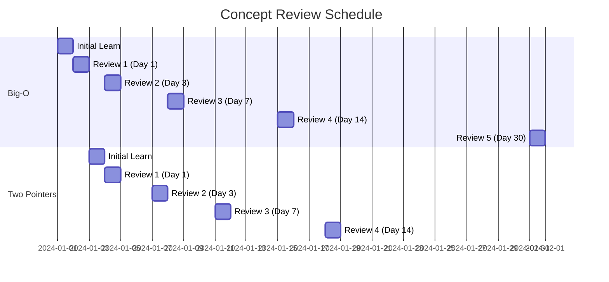
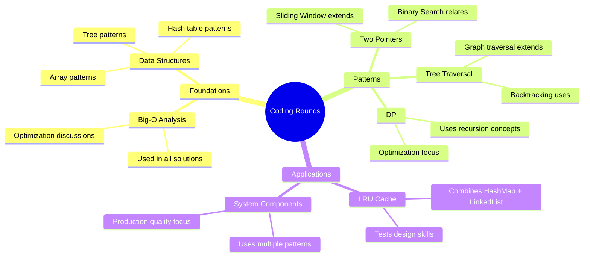

# Coding Rounds - Retention Strategy

## Spaced Repetition Schedule

### Core Concept Review Intervals

### Weekly Review Checklist

**Week 1-2 (Foundations)**:
- [ ] Big-O notation rules
- [ ] Array vs LinkedList operations
- [ ] Hash table collision handling
- [ ] Stack/Queue applications

**Week 3-4 (Core Patterns)**:
- [ ] Two pointer variants
- [ ] Sliding window template
- [ ] Binary search boundaries
- [ ] Tree traversal orders

**Week 5-6 (Advanced)**:
- [ ] Graph representations
- [ ] DFS vs BFS use cases
- [ ] Topological sort algorithm
- [ ] Union-Find operations

**Week 7-8 (DP & Specialized)**:
- [ ] DP identification criteria
- [ ] Memoization template
- [ ] Common DP patterns
- [ ] Backtracking template

**Week 9-10 (Staff Level)**:
- [ ] LRU Cache implementation
- [ ] Non-LeetCode problem approach
- [ ] Interview communication pattern
- [ ] Time management strategies

## Monthly Review Topics

### Month 1 Review
Focus: Foundation and basic patterns

| Topic | Quick Quiz | Practice Problem |
|-------|------------|------------------|
| Complexity Analysis | 3 questions | Profile existing code |
| Arrays | 3 questions | Rotate Array |
| Hash Tables | 3 questions | Two Sum |
| Two Pointers | 3 questions | Container With Most Water |
| Sliding Window | 3 questions | Longest Substring Without Repeat |

### Month 2 Review
Focus: Trees, graphs, and DP

| Topic | Quick Quiz | Practice Problem |
|-------|------------|------------------|
| Binary Trees | 3 questions | Validate BST |
| Graphs | 3 questions | Number of Islands |
| BFS/DFS | 3 questions | Word Ladder |
| DP Basics | 3 questions | Climbing Stairs |
| DP Advanced | 3 questions | Coin Change |

### Month 3+ Review
Focus: Staff-level readiness

| Topic | Quick Quiz | Practice Problem |
|-------|------------|------------------|
| System Implementation | Design questions | Build Rate Limiter |
| Code Quality | Review checklist | Refactor solution |
| Communication | Mock practice | Explain approach |

## Progressive Difficulty Increases

### Pattern: Two Pointers

**Level 1 (Easy)**:
- Two Sum (sorted array)
- Valid Palindrome
- Remove Duplicates from Sorted Array

**Level 2 (Medium)**:
- 3Sum
- Container With Most Water
- Trapping Rain Water (two pointer solution)

**Level 3 (Hard)**:
- 4Sum
- Minimum Window Substring (with sliding window)
- Substring with Concatenation of All Words

### Pattern: Dynamic Programming

**Level 1 (Easy)**:
- Climbing Stairs
- House Robber
- Maximum Subarray

**Level 2 (Medium)**:
- Coin Change
- Longest Increasing Subsequence
- Unique Paths

**Level 3 (Hard)**:
- Edit Distance
- Regular Expression Matching
- Burst Balloons

### Pattern: Non-LeetCode

**Level 1 (Basic Implementation)**:
- Stack using arrays
- Queue using linked list
- Simple LRU Cache (using OrderedDict)

**Level 2 (Production Quality)**:
- LRU Cache (from scratch)
- Log Parser
- Rate Limiter

**Level 3 (Staff Level)**:
- LFU Cache
- Distributed Rate Limiter design
- Task Scheduler with priorities

## Connection Maps Between Modules

## Daily Practice Routine

### 15-Minute Quick Review
1. Pick one concept from spaced repetition schedule
2. Answer 2-3 quick quiz questions
3. Trace through one example

### 30-Minute Problem Practice
1. Read problem (2 min)
2. Plan approach (5 min)
3. Implement (15 min)
4. Test and debug (5 min)
5. Review optimal solution (3 min)

### Weekend Deep Dive (2 hours)
1. Review week's weak areas (30 min)
2. Solve 2 medium problems (60 min)
3. Study one new pattern in depth (30 min)

## Retention Techniques

### Active Recall
- Close notes before trying to remember
- Explain concepts out loud
- Write code without looking at templates

### Interleaving
- Mix problem types rather than grouping
- Switch between patterns during practice
- Review old concepts while learning new ones

### Elaboration
- Connect new concepts to known ones
- Create analogies for patterns
- Explain solutions to imaginary audience

### Concrete Examples
- Work through specific test cases
- Visualize data structure operations
- Trace algorithm execution step by step

## Progress Tracking

### Weekly Metrics

| Metric | Target | Actual |
|--------|--------|--------|
| Problems solved | 10-15 | |
| New concepts learned | 2-3 | |
| Review sessions completed | 5 | |
| Mock interviews | 1 | |

### Skill Assessment Matrix

| Skill | Week 1 | Week 3 | Week 5 | Week 7 | Week 9 |
|-------|--------|--------|--------|--------|--------|
| Arrays | ☐ | ☐ | ☐ | ☐ | ☐ |
| Strings | ☐ | ☐ | ☐ | ☐ | ☐ |
| Two Pointers | ☐ | ☐ | ☐ | ☐ | ☐ |
| Binary Search | ☐ | ☐ | ☐ | ☐ | ☐ |
| Trees | ☐ | ☐ | ☐ | ☐ | ☐ |
| Graphs | ☐ | ☐ | ☐ | ☐ | ☐ |
| DP | ☐ | ☐ | ☐ | ☐ | ☐ |
| Non-LeetCode | ☐ | ☐ | ☐ | ☐ | ☐ |

Rating: 1-Not confident → 5-Very confident

## Flash Cards for Key Concepts

### Concept: Two Pointer Technique
**Front**: When to use two pointers?
**Back**: Sorted arrays, pair finding, palindromes, partitioning. Converging for target sums, same direction for fast/slow patterns.

### Concept: Sliding Window
**Front**: Sliding window vs two pointers?
**Back**: Sliding window specifically for contiguous subarray/substring problems. Uses left/right bounds that expand and contract based on condition.

### Concept: DP Identification
**Front**: How to identify a DP problem?
**Back**: Look for: (1) Optimal substructure - solution built from optimal sub-solutions, (2) Overlapping subproblems - same subproblems solved multiple times.

### Concept: Graph Traversal Choice
**Front**: When to use BFS vs DFS?
**Back**: BFS: shortest path in unweighted graph, level-order processing. DFS: path finding, exhaustive search, backtracking, topological sort.

### Concept: LRU Cache Design
**Front**: What data structures for O(1) LRU Cache?
**Back**: HashMap (O(1) lookup) + Doubly Linked List (O(1) insert/remove with reference). Map stores key → node reference.
