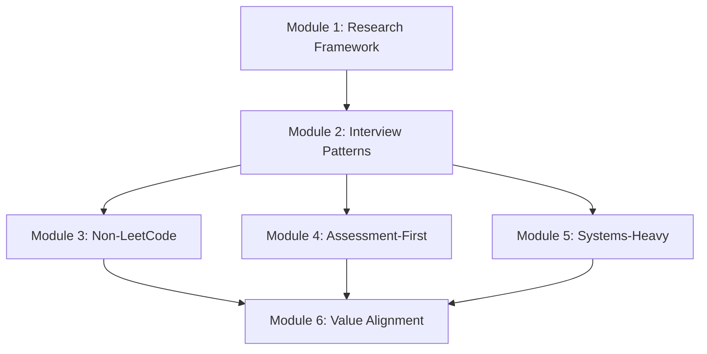

# Course Structure for Company-Specific Preparation

## Learning Path

### Progression
**Research → Understand → Practice → Apply**

- Research: Company values, interview process, question types
- Understand: What makes each company unique
- Practice: Company-specific question styles
- Apply: Tailor preparation for target companies

### Prerequisites
- Complete Coding Rounds (at least Modules 1-5)
- Complete System Design (at least Modules 1-4)
- Complete Behavioral (at least Modules 1-4)

## Module Overview

| Module | Title | Focus |
|--------|-------|-------|
| 1 | Company Research Framework | How to research any company effectively |
| 2 | Interview Process Patterns | Understanding different interview styles |
| 3 | Non-LeetCode Companies | Stripe, Netflix, OpenAI preparation |
| 4 | Assessment-First Companies | Anthropic, CodeSignal prep |
| 5 | Systems-Heavy Companies | Databricks, Snowflake preparation |
| 6 | Culture & Value Alignment | Mapping stories to company values |

---

## Modules

### Module 1: Company Research Framework
**Focus:** How to research any company effectively

**Learning Objectives:**
- Apply the CORE research method
- Use key resources effectively
- Build a research checklist
- Identify company-specific priorities

**Key Concepts:**
- Culture, Organization, Recent news, Evaluation criteria
- Resource prioritization
- Research time management

**Dependencies:** None

---

### Module 2: Interview Process Patterns
**Focus:** Understanding different interview styles

**Learning Objectives:**
- Recognize three main interview style groups
- Understand evaluation criteria differences
- Adapt preparation strategy by style
- Manage different round types

**Key Concepts:**
- Non-LeetCode practical style
- Online assessment first style
- Systems-heavy style
- Round type variations

**Dependencies:** Module 1

---

### Module 3: Non-LeetCode Companies (Stripe, Netflix, OpenAI)
**Focus:** Practical coding interview preparation

**Learning Objectives:**
- Excel at practical coding problems
- Handle multi-part questions
- Demonstrate code quality focus
- Navigate unique rounds (integration, bug squash)

**Key Concepts:**
- Real-world problem patterns
- Code quality signals
- Multi-part question strategy
- Integration and debugging rounds

**Dependencies:** Modules 1, 2

---

### Module 4: Assessment-First Companies (Anthropic)
**Focus:** Timed online assessment preparation

**Learning Objectives:**
- Maximize completion rate in timed assessments
- Write clean, modular code quickly
- Manage time across multi-level problems
- Achieve target scores (520+)

**Key Concepts:**
- CodeSignal-style assessments
- Time management strategies
- Modular code patterns
- Completion rate optimization

**Dependencies:** Modules 1, 2

---

### Module 5: Systems-Heavy Companies (Databricks, Snowflake)
**Focus:** Deep technical interview preparation

**Learning Objectives:**
- Demonstrate systems knowledge depth
- Handle panel presentation format
- Discuss trade-offs effectively
- Show domain expertise

**Key Concepts:**
- Distributed systems fundamentals
- Database internals
- Presentation skills
- Technical depth communication

**Dependencies:** Modules 1, 2

---

### Module 6: Culture & Value Alignment
**Focus:** Tailoring preparation for target companies

**Learning Objectives:**
- Map stories to company values
- Adapt communication style
- Demonstrate authentic alignment
- Ask insightful questions

**Key Concepts:**
- Value-story mapping
- Communication adaptation
- Authentic fit demonstration
- Company-specific questions

**Dependencies:** Modules 1-5

---

## Course Flow Diagram

## Time Estimates

| Module | Study Time | Practice Time | Total |
|--------|------------|---------------|-------|
| 1 | 1.5 hours | 1.5 hours | 3 hours |
| 2 | 1 hour | 1 hour | 2 hours |
| 3 | 2 hours | 6 hours | 8 hours |
| 4 | 1 hour | 5 hours | 6 hours |
| 5 | 2 hours | 4 hours | 6 hours |
| 6 | 1.5 hours | 2.5 hours | 4 hours |
| **Total** | **9 hours** | **20 hours** | **29 hours** |

## Recommended Schedule

### Per-Company Prep (2 weeks before interview)
- Week 1: Modules 1-2 + relevant style module (3, 4, or 5)
- Week 2: Module 6 + intensive practice

### Multi-Company Prep (4 weeks)
- Week 1: Modules 1-2
- Week 2: Module 3 (if targeting non-LeetCode companies)
- Week 3: Modules 4-5 (if targeting those styles)
- Week 4: Module 6 + mock interviews
