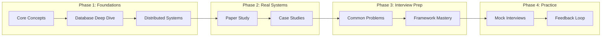
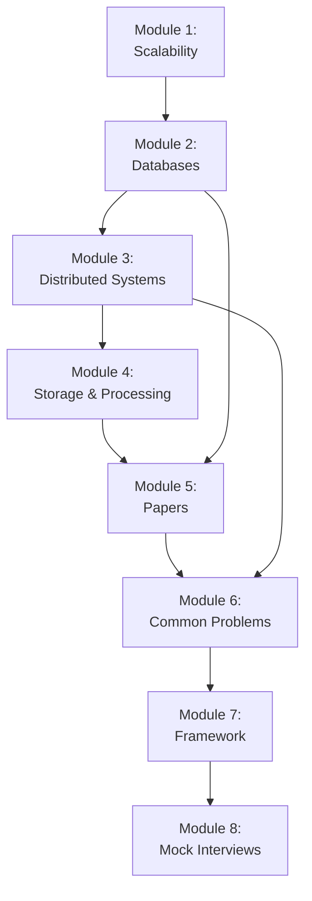

# Course Structure for System Design

## Learning Path

## Prerequisites

- Solid understanding of computer networking basics
- Experience building web applications
- Familiarity with at least one database system
- Basic understanding of cloud services
- Completed Coding Rounds preparation (recommended)

## Total Estimated Commitment

- **Study time**: 150-200 hours over 4-6 months
- **Papers/articles**: 15-20 deep reads
- **Practice designs**: 15-20 systems
- **Mock interviews**: 4-6 sessions

## Modules Overview

### Module 1: Scalability Fundamentals
- **Duration**: 10-12 hours
- **Learning objectives**:
  - Understand vertical vs horizontal scaling
  - Learn load balancing strategies
  - Master caching fundamentals
- **Key concepts**: Scaling dimensions, load balancers, cache layers
- **Dependencies**: None

### Module 2: Database Systems
- **Duration**: 15-20 hours
- **Learning objectives**:
  - Differentiate SQL vs NoSQL use cases
  - Understand sharding and replication
  - Master indexing and query optimization
- **Key concepts**: ACID, BASE, CAP theorem, partitioning strategies
- **Dependencies**: Module 1

### Module 3: Distributed Systems Fundamentals
- **Duration**: 15-20 hours
- **Learning objectives**:
  - Understand consensus algorithms (Paxos, Raft)
  - Learn consistency models
  - Master distributed transactions
- **Key concepts**: CAP theorem, vector clocks, two-phase commit
- **Dependencies**: Module 2

### Module 4: Storage and Data Processing
- **Duration**: 12-15 hours
- **Learning objectives**:
  - Understand distributed file systems
  - Learn message queue architectures
  - Master stream processing concepts
- **Key concepts**: Log-based systems, pub/sub, exactly-once semantics
- **Dependencies**: Module 3

### Module 5: Seminal Papers Study
- **Duration**: 20-25 hours
- **Learning objectives**:
  - Study Google GFS, Amazon Dynamo
  - Understand Kafka, Spanner architectures
  - Extract patterns from real systems
- **Key concepts**: Paper reading skills, pattern recognition
- **Dependencies**: Modules 1-4

### Module 6: Common System Design Problems
- **Duration**: 25-30 hours
- **Learning objectives**:
  - Design URL shortener, rate limiter
  - Design social media feeds, chat systems
  - Design video streaming, search systems
- **Key concepts**: Problem decomposition, trade-off analysis
- **Dependencies**: Module 5

### Module 7: Interview Framework Mastery
- **Duration**: 10-12 hours
- **Learning objectives**:
  - Master RESHADE framework
  - Practice capacity estimation
  - Develop communication patterns
- **Key concepts**: Time management, structured delivery
- **Dependencies**: Module 6

### Module 8: Mock Interviews and Feedback
- **Duration**: 15-20 hours
- **Learning objectives**:
  - Conduct realistic practice sessions
  - Receive and incorporate feedback
  - Build confidence under pressure
- **Key concepts**: Interview simulation, weak area identification
- **Dependencies**: Module 7

## Module Dependency Graph

## Weekly Study Plan (16 weeks)

### Weeks 1-4: Foundation Phase
- **Week 1-2**: Module 1 (Scalability) + DDIA Ch 1-3
- **Week 3-4**: Module 2 (Databases) + DDIA Ch 5-6

### Weeks 5-8: Distributed Systems
- **Week 5-6**: Module 3 (Distributed Systems) + DDIA Ch 9
- **Week 7-8**: Module 4 (Storage) + DDIA Ch 11

### Weeks 9-12: Papers and Problems
- **Week 9-10**: Module 5 (Papers) - Dynamo, GFS, Kafka
- **Week 11-12**: Module 6 (Common Problems) - 6 designs

### Weeks 13-16: Interview Preparation
- **Week 13**: Module 7 (Framework) + more designs
- **Week 14-16**: Module 8 (Mock Interviews) + refinement

## Assessment Checkpoints

| Checkpoint | After Module | Requirements |
|------------|--------------|--------------|
| Checkpoint 1 | Module 2 | Design simple KV store |
| Checkpoint 2 | Module 4 | Explain Dynamo paper |
| Checkpoint 3 | Module 6 | Complete 3 designs in framework |
| Final | Module 8 | Pass mock interview |

## Success Criteria

By completing this course, you should be able to:

1. **Complete a system design** in 45-60 minutes following the framework
2. **Estimate capacity** accurately for any system
3. **Discuss trade-offs** confidently at staff level
4. **Deep dive** into any component when asked
5. **Draw clear diagrams** that communicate design effectively
6. **Handle curveballs** like new requirements or failure scenarios

## Recommended Resources by Phase

### Phase 1
- DDIA Book (Chapters 1-6, 9, 11)
- MIT 6.824 Lectures (selected)
- ByteByteGo visualizations

### Phase 2
- Amazon Dynamo Paper
- Google GFS Paper
- Kafka Paper
- Facebook Memcache Paper

### Phase 3
- Alex Xu System Design Books
- HelloInterview.com
- YouTube channels (recommended in resources)

### Phase 4
- HelloInterview mock sessions
- Pramp peer practice
- Discord study groups
