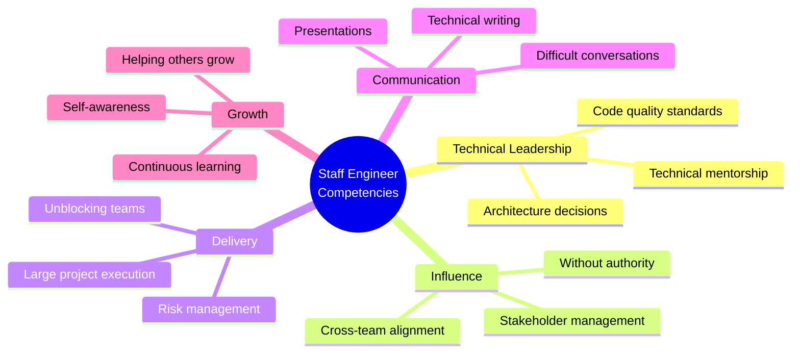
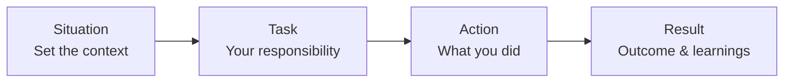

# Behavioral Rounds - Overview

## Topic Definition and Importance

Behavioral interviews evaluate whether candidates possess the soft skills, leadership qualities, and cultural fit needed for staff+ engineering roles. At senior levels, these rounds carry significant weight because:

1. **Leadership expectations**: Staff engineers influence and mentor others
2. **Cross-functional collaboration**: Must work effectively across teams
3. **Conflict resolution**: Navigate technical disagreements professionally
4. **Organizational impact**: Decisions affect broader organization
5. **Cultural stewardship**: Expected to uphold and shape culture

## Scope and Boundaries

### In Scope
- STAR method and storytelling frameworks
- Common behavioral question categories
- Staff-level leadership scenarios
- Conflict and difficult conversation handling
- Demonstrating technical leadership
- Cultural alignment strategies

### Out of Scope
- Technical coding skills
- System design abilities
- Company-specific technical questions

## Learning Objectives

By completing this module, you will be able to:

1. **Structure responses** using proven frameworks (STAR, SOAR)
2. **Prepare compelling stories** demonstrating staff-level competencies
3. **Handle challenging questions** about failures and conflicts
4. **Demonstrate leadership** without formal authority
5. **Show cultural alignment** while being authentic

## Staff-Level Behavioral Competencies

## Common Challenges and Solutions

### Challenge 1: Vague or Rambling Answers
**Problem**: Stories lack structure and clear outcomes
**Solution**:
- Use STAR framework religiously
- Practice with a timer (2-3 minutes per answer)
- Have clear metrics/outcomes prepared

### Challenge 2: No "Big" Stories
**Problem**: Feel experiences aren't impressive enough
**Solution**:
- Impact is relative to context
- Focus on your specific contribution
- Quantify results where possible
- Personal growth stories are valid

### Challenge 3: Handling Failure Questions
**Problem**: Uncomfortable discussing mistakes
**Solution**:
- Everyone expects failures; honesty builds trust
- Focus on learnings and changes made
- Choose failures with clear growth trajectory
- Avoid blame; take ownership

### Challenge 4: Demonstrating Leadership Without Title
**Problem**: Haven't had formal leadership roles
**Solution**:
- Technical leadership counts (design reviews, mentoring)
- Influence through expertise
- Initiative and ownership stories
- Process improvements

### Challenge 5: Cultural Fit Questions
**Problem**: Unsure what they're looking for
**Solution**:
- Research company values beforehand
- Choose stories that demonstrate alignment
- Be authentic - poor fit hurts both sides
- Ask questions that show cultural curiosity

## STAR Framework

### Detailed Breakdown

**Situation** (15% of time):
- Briefly set the scene
- Provide relevant context only
- Include stakes/importance

**Task** (15% of time):
- Your specific role/responsibility
- What was expected of you
- Challenges you faced

**Action** (50% of time):
- Specific steps YOU took
- Decision-making process
- Collaboration with others
- Challenges overcome

**Result** (20% of time):
- Quantified outcomes when possible
- Business impact
- What you learned
- What you'd do differently

## Question Categories

### 1. Technical Leadership
- "Tell me about a technical decision you drove"
- "Describe a time you improved code quality on your team"
- "How have you mentored junior engineers?"

### 2. Conflict & Collaboration
- "Tell me about a disagreement with a colleague"
- "Describe working with a difficult stakeholder"
- "How do you handle pushback on your ideas?"

### 3. Failure & Growth
- "Tell me about a project that failed"
- "Describe your biggest mistake"
- "What's the toughest feedback you've received?"

### 4. Influence & Leadership
- "How have you influenced without authority?"
- "Tell me about leading a cross-team initiative"
- "Describe changing someone's mind on a technical approach"

### 5. Delivery & Execution
- "Tell me about delivering under pressure"
- "Describe managing a complex project"
- "How do you prioritize when everything is urgent?"

### 6. Growth & Learning
- "How do you stay current technically?"
- "Tell me about learning something new quickly"
- "What would your team say are your areas for growth?"

## Interview Format

### Typical Structure (45-60 minutes)
- Introduction: 5 minutes
- Behavioral questions: 35-45 minutes (4-6 questions)
- Your questions: 5-10 minutes

### Staff-Level Depth
Expect follow-up questions that probe:
- Your specific contributions vs. team efforts
- Alternative approaches considered
- Long-term impact of decisions
- How you'd do it differently now
- How this experience shaped your approach

## Success Metrics

### Preparation Checklist
- [ ] 10-15 polished stories covering all categories
- [ ] Stories tailored for target company values
- [ ] Practiced with timer (2-3 min each)
- [ ] Received feedback from peers
- [ ] Prepared thoughtful questions

### During Interview
- [ ] Used STAR framework consistently
- [ ] Provided specific examples
- [ ] Quantified results where possible
- [ ] Showed self-awareness and growth
- [ ] Demonstrated company value alignment
