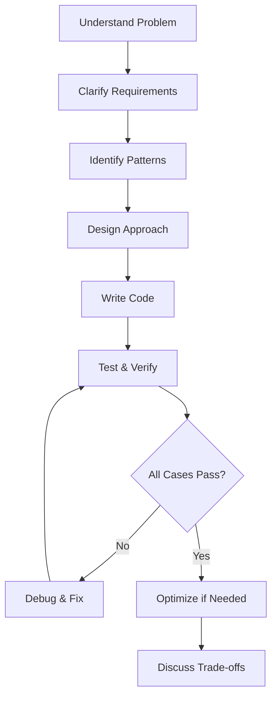
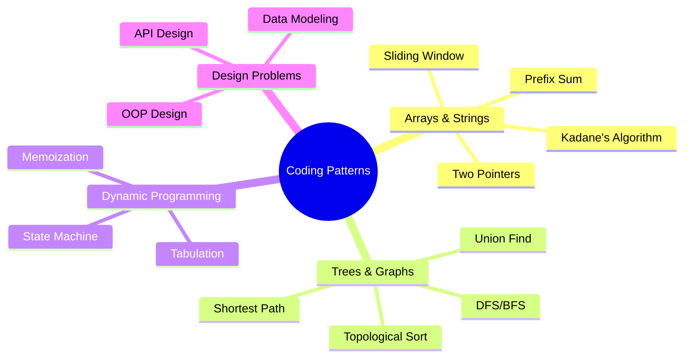
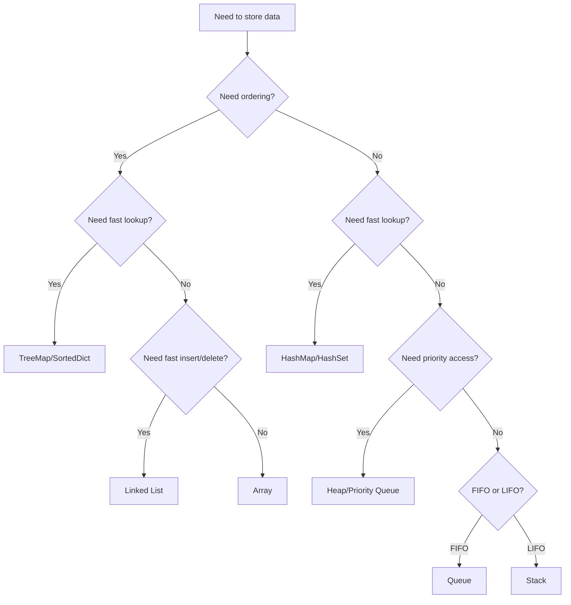
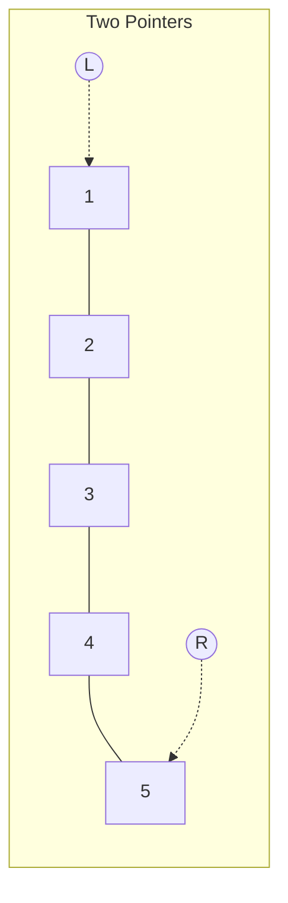
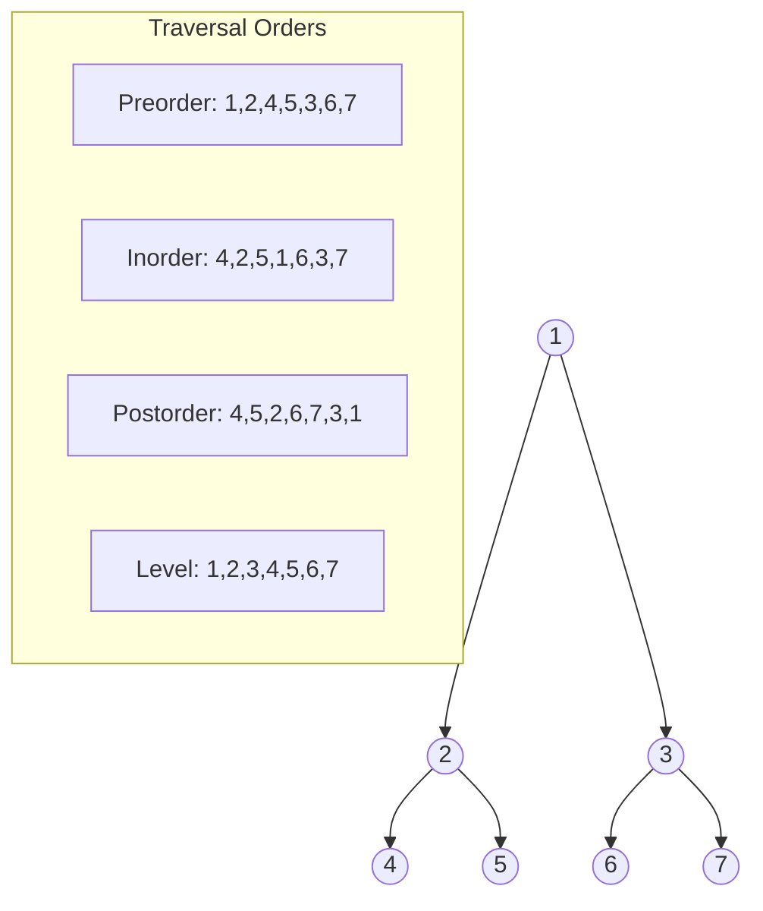
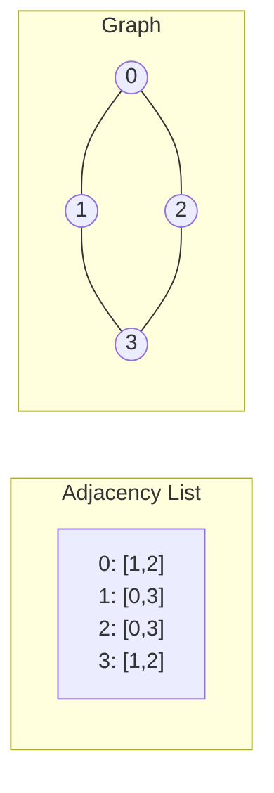

# Coding Rounds - Core Concepts

## Fundamental Principles

### 1. Problem-Solving Framework



### 2. The UMPIRE Method

- **U**nderstand the problem
- **M**atch to known patterns
- **P**lan your approach
- **I**mplement the solution
- **R**eview and test
- **E**valuate complexity

## Key Terminology and Definitions

### Time Complexity
- **O(1)**: Constant time - operations that don't depend on input size
- **O(log n)**: Logarithmic - binary search, balanced tree operations
- **O(n)**: Linear - single pass through data
- **O(n log n)**: Linearithmic - efficient sorting algorithms
- **O(n²)**: Quadratic - nested iterations
- **O(2ⁿ)**: Exponential - exhaustive search, naive recursion

### Space Complexity
- **In-place**: O(1) extra space
- **Linear space**: O(n) for auxiliary data structures
- **Recursion stack**: O(depth) for recursive calls

### Data Structure Operations Complexity

| Data Structure | Access | Search | Insert | Delete |
|---------------|--------|--------|--------|--------|
| Array | O(1) | O(n) | O(n) | O(n) |
| Linked List | O(n) | O(n) | O(1) | O(1) |
| Hash Table | N/A | O(1)* | O(1)* | O(1)* |
| BST (balanced) | O(log n) | O(log n) | O(log n) | O(log n) |
| Heap | O(1) top | O(n) | O(log n) | O(log n) |

*Amortized average case

## Mental Models and Frameworks

### Pattern Recognition Framework



### Decision Tree for Data Structure Selection



## Core Algorithm Patterns

### 1. Two Pointers Pattern
**Use when**: Searching pairs in sorted array, palindrome checking, partitioning

```python
def two_sum_sorted(arr, target):
    left, right = 0, len(arr) - 1
    while left < right:
        current_sum = arr[left] + arr[right]
        if current_sum == target:
            return [left, right]
        elif current_sum < target:
            left += 1
        else:
            right -= 1
    return []
```

### 2. Sliding Window Pattern
**Use when**: Subarray/substring problems with contiguous elements

```python
def max_sum_subarray(arr, k):
    window_sum = sum(arr[:k])
    max_sum = window_sum

    for i in range(k, len(arr)):
        window_sum += arr[i] - arr[i - k]
        max_sum = max(max_sum, window_sum)

    return max_sum
```

### 3. Fast & Slow Pointers
**Use when**: Cycle detection, finding middle element

```python
def has_cycle(head):
    slow = fast = head
    while fast and fast.next:
        slow = slow.next
        fast = fast.next.next
        if slow == fast:
            return True
    return False
```

### 4. Binary Search Pattern
**Use when**: Sorted data, finding boundaries, optimization problems

```python
def binary_search(arr, target):
    left, right = 0, len(arr) - 1
    while left <= right:
        mid = left + (right - left) // 2
        if arr[mid] == target:
            return mid
        elif arr[mid] < target:
            left = mid + 1
        else:
            right = mid - 1
    return -1
```

### 5. DFS/BFS Pattern
**Use when**: Tree/graph traversal, path finding, level-order processing

```python
# DFS with stack
def dfs_iterative(root):
    if not root:
        return []
    result, stack = [], [root]
    while stack:
        node = stack.pop()
        result.append(node.val)
        if node.right:
            stack.append(node.right)
        if node.left:
            stack.append(node.left)
    return result

# BFS with queue
from collections import deque

def bfs(root):
    if not root:
        return []
    result, queue = [], deque([root])
    while queue:
        node = queue.popleft()
        result.append(node.val)
        if node.left:
            queue.append(node.left)
        if node.right:
            queue.append(node.right)
    return result
```

### 6. Dynamic Programming Pattern
**Use when**: Overlapping subproblems, optimal substructure

```python
# Memoization (top-down)
def fib_memo(n, memo={}):
    if n in memo:
        return memo[n]
    if n <= 1:
        return n
    memo[n] = fib_memo(n-1, memo) + fib_memo(n-2, memo)
    return memo[n]

# Tabulation (bottom-up)
def fib_tab(n):
    if n <= 1:
        return n
    dp = [0] * (n + 1)
    dp[1] = 1
    for i in range(2, n + 1):
        dp[i] = dp[i-1] + dp[i-2]
    return dp[n]
```

## Visual Diagrams

### Array Operations Visualization



### Tree Traversal Orders



### Graph Representations



## Code Quality Principles

### 1. Meaningful Names
```python
# Bad
def f(a, b):
    return a * b + a

# Good
def calculate_total_with_tax(price, tax_rate):
    return price * tax_rate + price
```

### 2. Single Responsibility
```python
# Each function does one thing well
def parse_input(raw_data):
    """Parse raw input into structured format."""
    pass

def validate_data(parsed_data):
    """Validate parsed data meets requirements."""
    pass

def process_data(validated_data):
    """Process validated data and return results."""
    pass
```

### 3. Edge Case Handling
```python
def find_max(arr):
    if not arr:
        return None  # Handle empty array
    if len(arr) == 1:
        return arr[0]  # Handle single element
    return max(arr)
```
