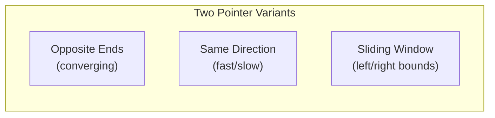
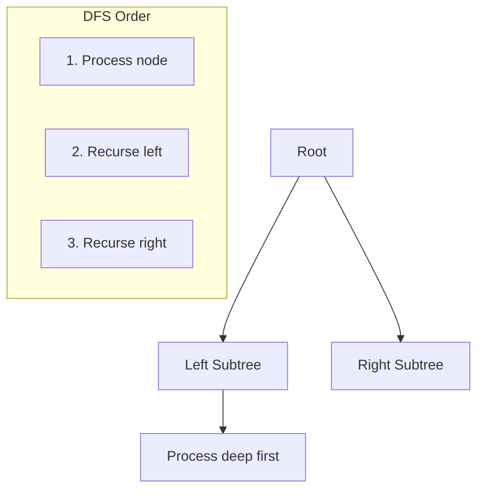
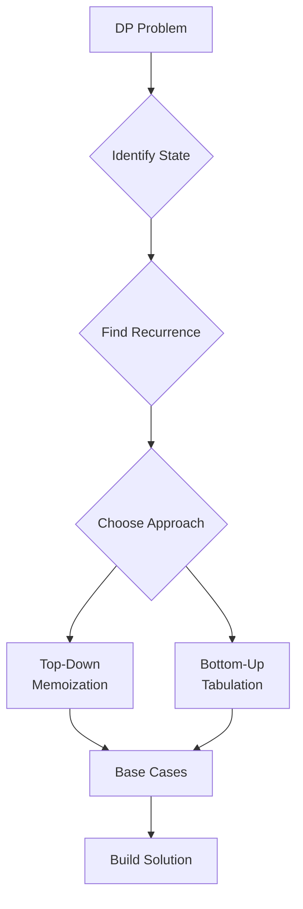
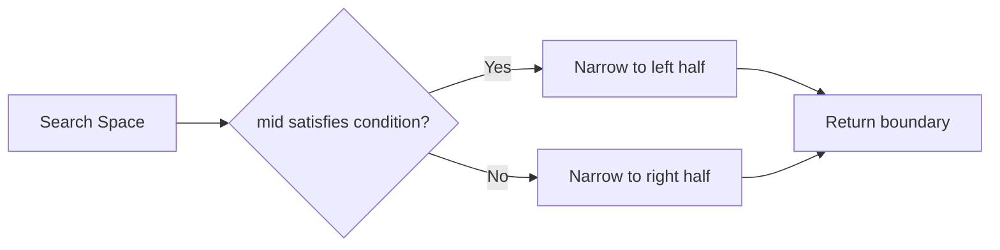
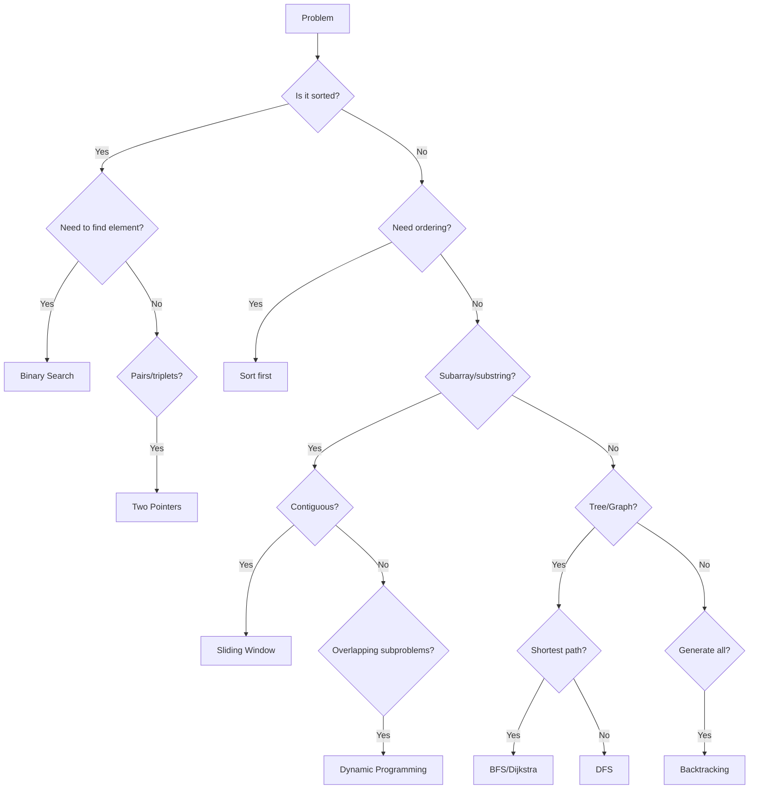

# Coding Rounds - Patterns and Frameworks

## Common Patterns Identified Across Resources

### Pattern 1: Array and String Manipulation

#### Two Pointers
**When to use**: Sorted arrays, pair finding, palindrome checking, partitioning



**Template**:
```python
def two_pointer_opposite(arr):
    left, right = 0, len(arr) - 1
    while left < right:
        # Process arr[left] and arr[right]
        if condition_to_move_left:
            left += 1
        else:
            right -= 1
```

**Common Problems**:
- Two Sum (sorted array)
- 3Sum / 4Sum
- Container With Most Water
- Trapping Rain Water
- Valid Palindrome

#### Sliding Window
**When to use**: Contiguous subarray/substring with constraints

**Template**:
```python
def sliding_window_variable(arr, condition):
    left = 0
    result = initial_value
    window_state = {}  # or other state tracking

    for right in range(len(arr)):
        # Expand window: add arr[right] to state
        update_state(window_state, arr[right])

        # Contract window while invalid
        while not valid(window_state, condition):
            # Remove arr[left] from state
            remove_from_state(window_state, arr[left])
            left += 1

        # Update result
        result = update_result(result, right - left + 1)

    return result
```

**Common Problems**:
- Maximum Sum Subarray of Size K
- Longest Substring Without Repeating Characters
- Minimum Window Substring
- Fruit Into Baskets
- Longest Repeating Character Replacement

### Pattern 2: Tree and Graph Traversal

#### DFS (Depth-First Search)
**When to use**: Path finding, tree traversal, exhaustive search, backtracking



**Template (Recursive)**:
```python
def dfs_recursive(node, state):
    if not node:
        return base_case

    # Pre-order processing
    process(node)

    # Recurse
    left_result = dfs_recursive(node.left, state)
    right_result = dfs_recursive(node.right, state)

    # Post-order processing
    return combine(left_result, right_result)
```

**Template (Iterative with Stack)**:
```python
def dfs_iterative(root):
    if not root:
        return []

    result = []
    stack = [root]

    while stack:
        node = stack.pop()
        result.append(node.val)

        # Add right first so left is processed first
        if node.right:
            stack.append(node.right)
        if node.left:
            stack.append(node.left)

    return result
```

#### BFS (Breadth-First Search)
**When to use**: Shortest path (unweighted), level-order traversal, nearest neighbor

**Template**:
```python
from collections import deque

def bfs(start):
    queue = deque([start])
    visited = {start}
    level = 0

    while queue:
        level_size = len(queue)
        for _ in range(level_size):
            node = queue.popleft()
            process(node, level)

            for neighbor in get_neighbors(node):
                if neighbor not in visited:
                    visited.add(neighbor)
                    queue.append(neighbor)
        level += 1
```

**Common Problems**:
- Binary Tree Level Order Traversal
- Word Ladder
- Rotting Oranges
- Shortest Path in Binary Matrix
- Clone Graph

### Pattern 3: Dynamic Programming



#### Decision Framework

| Characteristic | Top-Down (Memo) | Bottom-Up (Tab) |
|---------------|-----------------|-----------------|
| Implementation | More intuitive | Often faster |
| Space | Can be optimized | Fixed table size |
| Subproblems | Only needed ones | All subproblems |
| Stack | Risk of overflow | No recursion |

**Common DP Patterns**:

1. **Linear DP** (1D state)
   - Climbing Stairs
   - House Robber
   - Maximum Subarray

2. **Grid DP** (2D state)
   - Unique Paths
   - Minimum Path Sum
   - Edit Distance

3. **String DP**
   - Longest Common Subsequence
   - Longest Palindromic Substring
   - Word Break

4. **Decision DP**
   - Knapsack variations
   - Coin Change
   - Partition problems

**Template**:
```python
# Bottom-up DP template
def dp_solution(input):
    n = len(input)

    # Initialize DP table
    dp = [[0] * cols for _ in range(rows)]

    # Base cases
    dp[0][0] = base_value

    # Fill table
    for i in range(rows):
        for j in range(cols):
            # Recurrence relation
            dp[i][j] = optimal(
                dp[i-1][j] + cost1,  # Option 1
                dp[i][j-1] + cost2,  # Option 2
                dp[i-1][j-1] + cost3 # Option 3
            )

    return dp[rows-1][cols-1]
```

### Pattern 4: Binary Search

**When to use**: Sorted data, finding boundaries, optimization with monotonic function



**Template (Finding Left Boundary)**:
```python
def binary_search_left(arr, target):
    left, right = 0, len(arr)

    while left < right:
        mid = left + (right - left) // 2
        if arr[mid] < target:
            left = mid + 1
        else:
            right = mid

    return left  # First position where arr[i] >= target
```

**Template (Finding Right Boundary)**:
```python
def binary_search_right(arr, target):
    left, right = 0, len(arr)

    while left < right:
        mid = left + (right - left) // 2
        if arr[mid] <= target:
            left = mid + 1
        else:
            right = mid

    return left - 1  # Last position where arr[i] <= target
```

### Pattern 5: Backtracking

**When to use**: Generate permutations/combinations, constraint satisfaction, exhaustive search

**Template**:
```python
def backtrack(state, choices, result):
    if is_solution(state):
        result.append(state.copy())
        return

    for choice in choices:
        if is_valid(choice, state):
            # Make choice
            state.append(choice)

            # Explore
            backtrack(state, remaining_choices, result)

            # Undo choice
            state.pop()
```

**Common Problems**:
- Subsets
- Permutations
- Combinations
- N-Queens
- Sudoku Solver
- Word Search

### Pattern 6: Graph Algorithms

#### Topological Sort
**When to use**: Dependency ordering, course scheduling, build systems

```python
def topological_sort(graph):
    in_degree = {node: 0 for node in graph}
    for node in graph:
        for neighbor in graph[node]:
            in_degree[neighbor] += 1

    queue = deque([n for n in in_degree if in_degree[n] == 0])
    result = []

    while queue:
        node = queue.popleft()
        result.append(node)

        for neighbor in graph[node]:
            in_degree[neighbor] -= 1
            if in_degree[neighbor] == 0:
                queue.append(neighbor)

    return result if len(result) == len(graph) else []  # Cycle check
```

#### Union-Find (Disjoint Set)
**When to use**: Connected components, cycle detection, network connectivity

```python
class UnionFind:
    def __init__(self, n):
        self.parent = list(range(n))
        self.rank = [0] * n

    def find(self, x):
        if self.parent[x] != x:
            self.parent[x] = self.find(self.parent[x])  # Path compression
        return self.parent[x]

    def union(self, x, y):
        px, py = self.find(x), self.find(y)
        if px == py:
            return False
        # Union by rank
        if self.rank[px] < self.rank[py]:
            px, py = py, px
        self.parent[py] = px
        if self.rank[px] == self.rank[py]:
            self.rank[px] += 1
        return True
```

## Best Practices vs Anti-Patterns

### Best Practices

| Practice | Why |
|----------|-----|
| Clarify requirements first | Avoid solving wrong problem |
| State assumptions explicitly | Shows thoroughness |
| Start with brute force | Establishes correctness baseline |
| Test with examples | Catches bugs early |
| Discuss trade-offs | Demonstrates experience |
| Use meaningful names | Improves readability |
| Handle edge cases | Shows attention to detail |

### Anti-Patterns

| Anti-Pattern | Better Approach |
|--------------|-----------------|
| Jumping to code immediately | Plan approach first |
| Optimizing prematurely | Get working solution first |
| Silent coding | Think aloud |
| Ignoring hints | Listen and adapt |
| Giving up on bugs | Debug systematically |
| Over-engineering | Keep it simple |

## Decision-Making Framework



## Templates and Structures

### Problem Analysis Template
```markdown
## Problem: [Name]

### Understanding
- Input:
- Output:
- Constraints:
- Edge cases:

### Approach
1. Pattern identified:
2. Data structures needed:
3. Time complexity target:
4. Space complexity target:

### Solution Steps
1.
2.
3.

### Code

### Testing
- Test case 1:
- Test case 2:
- Edge case:
```

### Interview Communication Template
```
1. "Let me make sure I understand the problem..."
   - Restate the problem
   - Clarify inputs/outputs
   - Ask about constraints

2. "Before I start coding, let me think about approaches..."
   - Discuss brute force
   - Identify patterns
   - Propose optimal approach

3. "My approach will be..."
   - Explain algorithm
   - Discuss time/space complexity

4. "Let me trace through an example..."
   - Walk through with sample input

5. "Now I'll implement..."
   - Code with commentary

6. "Let me test this..."
   - Run through test cases
   - Check edge cases
```
