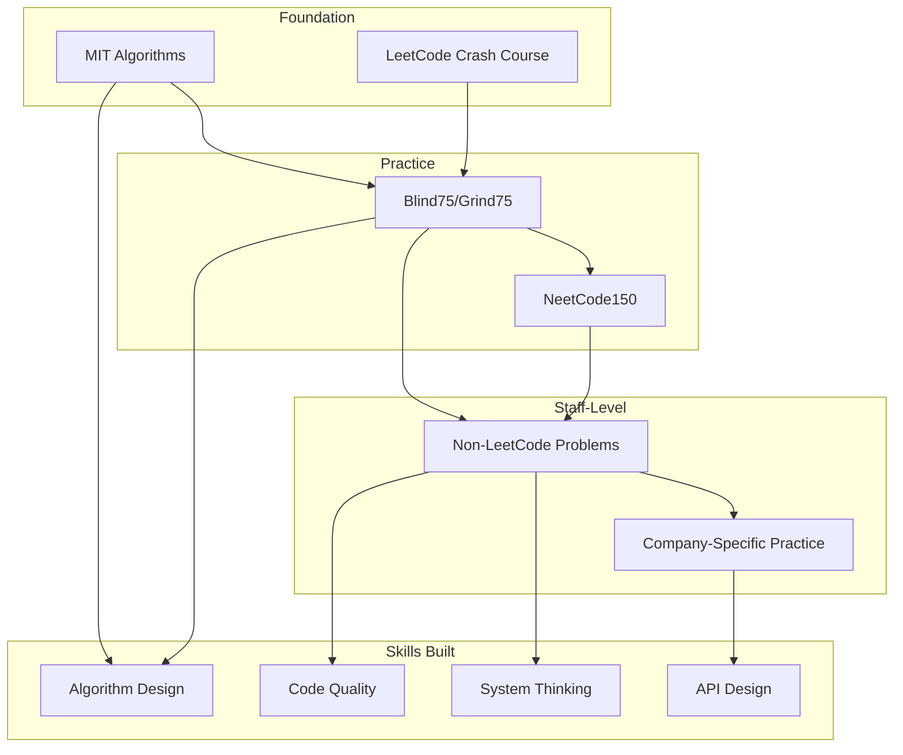

# Coding Rounds - Deep Dive Notes

## Deep Dive: Non-LeetCode Style Problems

### Understanding the Shift at Staff Level

At staff level, companies like Netflix, Stripe, OpenAI, and Anthropic have moved away from traditional LeetCode-style questions. The reasoning:

1. **Real-world relevance**: Daily work involves building systems, not solving algorithmic puzzles
2. **Code quality matters**: Production code needs to be maintainable
3. **Design decisions**: Staff engineers make architectural choices constantly
4. **Testing mindset**: Writing tests is part of the job

### Deep Dive: LRU Cache Implementation

This is one of the most commonly asked non-LeetCode questions because it tests multiple skills:

```python
from collections import OrderedDict

class LRUCache:
    """
    Least Recently Used Cache implementation.

    Design decisions:
    1. OrderedDict gives us O(1) operations with ordering
    2. move_to_end() maintains access order
    3. popitem(last=False) removes oldest item
    """

    def __init__(self, capacity: int):
        self.capacity = capacity
        self.cache = OrderedDict()

    def get(self, key: int) -> int:
        if key not in self.cache:
            return -1
        # Move to end to mark as recently used
        self.cache.move_to_end(key)
        return self.cache[key]

    def put(self, key: int, value: int) -> None:
        if key in self.cache:
            # Update and move to end
            self.cache.move_to_end(key)
        self.cache[key] = value

        if len(self.cache) > self.capacity:
            # Remove oldest (first) item
            self.cache.popitem(last=False)
```

**Alternative Implementation (HashMap + Doubly Linked List)**:
```python
class Node:
    def __init__(self, key=0, val=0):
        self.key = key
        self.val = val
        self.prev = None
        self.next = None

class LRUCache:
    def __init__(self, capacity: int):
        self.capacity = capacity
        self.cache = {}  # key -> Node

        # Dummy head and tail for easier manipulation
        self.head = Node()
        self.tail = Node()
        self.head.next = self.tail
        self.tail.prev = self.head

    def _add_to_front(self, node):
        """Add node right after head (most recent)."""
        node.prev = self.head
        node.next = self.head.next
        self.head.next.prev = node
        self.head.next = node

    def _remove(self, node):
        """Remove node from its current position."""
        node.prev.next = node.next
        node.next.prev = node.prev

    def get(self, key: int) -> int:
        if key not in self.cache:
            return -1

        node = self.cache[key]
        self._remove(node)
        self._add_to_front(node)
        return node.val

    def put(self, key: int, value: int) -> None:
        if key in self.cache:
            self._remove(self.cache[key])

        node = Node(key, value)
        self.cache[key] = node
        self._add_to_front(node)

        if len(self.cache) > self.capacity:
            # Remove from tail (least recent)
            lru = self.tail.prev
            self._remove(lru)
            del self.cache[lru.key]
```

### Deep Dive: Log Parser with Concurrency

This problem tests string processing, data aggregation, and thread safety:

```python
import threading
from collections import defaultdict
from datetime import datetime
import re

class LogParser:
    """
    Thread-safe log parser that aggregates metrics.

    Design considerations:
    1. Use locks for thread safety
    2. Efficient regex for parsing
    3. Flexible aggregation methods
    """

    LOG_PATTERN = re.compile(
        r'^\[(?P<timestamp>[\d\-T:.]+)\] '
        r'(?P<level>\w+) '
        r'(?P<service>\w+): '
        r'(?P<message>.*)$'
    )

    def __init__(self):
        self.lock = threading.RLock()
        self.logs = []
        self.error_count = defaultdict(int)
        self.service_count = defaultdict(int)

    def parse_line(self, line: str) -> dict:
        """Parse a single log line into structured data."""
        match = self.LOG_PATTERN.match(line.strip())
        if not match:
            return None

        return {
            'timestamp': datetime.fromisoformat(match.group('timestamp')),
            'level': match.group('level'),
            'service': match.group('service'),
            'message': match.group('message')
        }

    def ingest(self, line: str) -> bool:
        """Thread-safe log ingestion."""
        parsed = self.parse_line(line)
        if not parsed:
            return False

        with self.lock:
            self.logs.append(parsed)
            self.service_count[parsed['service']] += 1
            if parsed['level'] == 'ERROR':
                self.error_count[parsed['service']] += 1

        return True

    def get_error_rate(self, service: str) -> float:
        """Get error rate for a service."""
        with self.lock:
            total = self.service_count.get(service, 0)
            errors = self.error_count.get(service, 0)
            return errors / total if total > 0 else 0.0

    def get_logs_in_range(self, start: datetime, end: datetime) -> list:
        """Get logs within a time range."""
        with self.lock:
            return [
                log for log in self.logs
                if start <= log['timestamp'] <= end
            ]


# Testing
def test_log_parser():
    parser = LogParser()

    # Test basic parsing
    lines = [
        "[2024-01-15T10:30:00] INFO auth: User login successful",
        "[2024-01-15T10:30:01] ERROR auth: Failed to validate token",
        "[2024-01-15T10:30:02] INFO payment: Transaction processed",
    ]

    for line in lines:
        assert parser.ingest(line)

    # Test error rate
    assert parser.get_error_rate('auth') == 0.5
    assert parser.get_error_rate('payment') == 0.0

    print("All tests passed!")

test_log_parser()
```

### Deep Dive: In-Memory SQL Engine

This problem appears at OpenAI and tests parsing, data structures, and query execution:

```python
from typing import List, Dict, Any, Optional
import re
from dataclasses import dataclass
from enum import Enum

class TokenType(Enum):
    SELECT = "SELECT"
    INSERT = "INSERT"
    INTO = "INTO"
    FROM = "FROM"
    WHERE = "WHERE"
    AND = "AND"
    OR = "OR"
    ORDER = "ORDER"
    BY = "BY"
    VALUES = "VALUES"
    CREATE = "CREATE"
    TABLE = "TABLE"
    IDENTIFIER = "IDENTIFIER"
    NUMBER = "NUMBER"
    STRING = "STRING"
    OPERATOR = "OPERATOR"
    COMMA = "COMMA"
    STAR = "STAR"
    LPAREN = "LPAREN"
    RPAREN = "RPAREN"

@dataclass
class Token:
    type: TokenType
    value: Any

class SQLEngine:
    """
    Simple in-memory SQL engine supporting:
    - CREATE TABLE
    - INSERT INTO
    - SELECT with WHERE, ORDER BY
    """

    def __init__(self):
        self.tables: Dict[str, Dict] = {}  # table_name -> {columns, rows}

    def execute(self, query: str) -> Any:
        """Execute a SQL query."""
        tokens = self._tokenize(query)

        if not tokens:
            raise ValueError("Empty query")

        if tokens[0].type == TokenType.CREATE:
            return self._execute_create(tokens)
        elif tokens[0].type == TokenType.INSERT:
            return self._execute_insert(tokens)
        elif tokens[0].type == TokenType.SELECT:
            return self._execute_select(tokens)
        else:
            raise ValueError(f"Unknown command: {tokens[0].value}")

    def _tokenize(self, query: str) -> List[Token]:
        """Tokenize SQL query."""
        tokens = []
        keywords = {
            'SELECT', 'INSERT', 'INTO', 'FROM', 'WHERE',
            'AND', 'OR', 'ORDER', 'BY', 'VALUES', 'CREATE', 'TABLE'
        }
        operators = {'=', '!=', '<', '>', '<=', '>='}

        # Simple tokenizer
        pattern = r"(\w+|'[^']*'|\d+|[=!<>]+|[,*()])"
        for match in re.finditer(pattern, query):
            word = match.group(1)

            if word.upper() in keywords:
                tokens.append(Token(TokenType[word.upper()], word.upper()))
            elif word == ',':
                tokens.append(Token(TokenType.COMMA, word))
            elif word == '*':
                tokens.append(Token(TokenType.STAR, word))
            elif word == '(':
                tokens.append(Token(TokenType.LPAREN, word))
            elif word == ')':
                tokens.append(Token(TokenType.RPAREN, word))
            elif word in operators:
                tokens.append(Token(TokenType.OPERATOR, word))
            elif word.isdigit():
                tokens.append(Token(TokenType.NUMBER, int(word)))
            elif word.startswith("'"):
                tokens.append(Token(TokenType.STRING, word[1:-1]))
            else:
                tokens.append(Token(TokenType.IDENTIFIER, word))

        return tokens

    def _execute_create(self, tokens: List[Token]) -> str:
        """CREATE TABLE table_name (col1, col2, ...)"""
        # Parse: CREATE TABLE name (columns)
        idx = 2  # Skip CREATE TABLE
        table_name = tokens[idx].value
        idx += 2  # Skip name and LPAREN

        columns = []
        while tokens[idx].type != TokenType.RPAREN:
            if tokens[idx].type == TokenType.IDENTIFIER:
                columns.append(tokens[idx].value)
            idx += 1

        self.tables[table_name] = {'columns': columns, 'rows': []}
        return f"Table {table_name} created"

    def _execute_insert(self, tokens: List[Token]) -> str:
        """INSERT INTO table_name VALUES (v1, v2, ...)"""
        idx = 2  # Skip INSERT INTO
        table_name = tokens[idx].value
        idx += 2  # Skip name and VALUES
        idx += 1  # Skip LPAREN

        values = []
        while tokens[idx].type != TokenType.RPAREN:
            if tokens[idx].type in (TokenType.NUMBER, TokenType.STRING, TokenType.IDENTIFIER):
                values.append(tokens[idx].value)
            idx += 1

        if table_name not in self.tables:
            raise ValueError(f"Table {table_name} does not exist")

        table = self.tables[table_name]
        if len(values) != len(table['columns']):
            raise ValueError("Column count mismatch")

        row = dict(zip(table['columns'], values))
        table['rows'].append(row)
        return "1 row inserted"

    def _execute_select(self, tokens: List[Token]) -> List[Dict]:
        """SELECT columns FROM table WHERE conditions ORDER BY column"""
        idx = 1  # Skip SELECT

        # Parse columns
        columns = []
        while tokens[idx].type != TokenType.FROM:
            if tokens[idx].type == TokenType.STAR:
                columns = ['*']
            elif tokens[idx].type == TokenType.IDENTIFIER:
                columns.append(tokens[idx].value)
            idx += 1

        idx += 1  # Skip FROM
        table_name = tokens[idx].value
        idx += 1

        if table_name not in self.tables:
            raise ValueError(f"Table {table_name} does not exist")

        table = self.tables[table_name]
        rows = table['rows'].copy()

        # Handle WHERE
        if idx < len(tokens) and tokens[idx].type == TokenType.WHERE:
            idx += 1
            rows = self._filter_rows(rows, tokens, idx)

        # Project columns
        if columns != ['*']:
            rows = [{col: row[col] for col in columns} for row in rows]

        return rows

    def _filter_rows(self, rows: List[Dict], tokens: List[Token], start_idx: int) -> List[Dict]:
        """Apply WHERE conditions."""
        result = []

        # Simple single condition: column op value
        col = tokens[start_idx].value
        op = tokens[start_idx + 1].value
        val = tokens[start_idx + 2].value

        for row in rows:
            if self._evaluate_condition(row.get(col), op, val):
                result.append(row)

        return result

    def _evaluate_condition(self, left: Any, op: str, right: Any) -> bool:
        """Evaluate a single condition."""
        if op == '=':
            return left == right
        elif op == '!=':
            return left != right
        elif op == '<':
            return left < right
        elif op == '>':
            return left > right
        elif op == '<=':
            return left <= right
        elif op == '>=':
            return left >= right
        return False


# Example usage and testing
def test_sql_engine():
    db = SQLEngine()

    # Create table
    print(db.execute("CREATE TABLE users (id, name, age)"))

    # Insert data
    print(db.execute("INSERT INTO users VALUES (1, 'Alice', 30)"))
    print(db.execute("INSERT INTO users VALUES (2, 'Bob', 25)"))
    print(db.execute("INSERT INTO users VALUES (3, 'Charlie', 35)"))

    # Select all
    print("All users:", db.execute("SELECT * FROM users"))

    # Select with WHERE
    print("Age > 25:", db.execute("SELECT name, age FROM users WHERE age > 25"))

test_sql_engine()
```

### Deep Dive: Versioned Key-Value Store

This appears at OpenAI and Snowflake:

```python
import threading
from collections import defaultdict
from typing import Optional, Any
import time

class VersionedKVStore:
    """
    Key-Value store with version tracking.

    Features:
    - Each put() creates a new version
    - get() can retrieve value at specific version
    - Thread-safe operations
    """

    def __init__(self):
        self.lock = threading.Lock()
        self.store = defaultdict(list)  # key -> [(version, value), ...]
        self.version = 0

    def put(self, key: str, value: Any) -> int:
        """
        Store value for key, return version number.
        """
        with self.lock:
            self.version += 1
            self.store[key].append((self.version, value))
            return self.version

    def get(self, key: str, version: Optional[int] = None) -> Optional[Any]:
        """
        Get value for key.
        If version specified, get value at that version.
        Otherwise, get latest value.
        """
        with self.lock:
            if key not in self.store:
                return None

            versions = self.store[key]

            if version is None:
                # Return latest
                return versions[-1][1] if versions else None

            # Binary search for version
            left, right = 0, len(versions) - 1
            result = None

            while left <= right:
                mid = (left + right) // 2
                if versions[mid][0] <= version:
                    result = versions[mid][1]
                    left = mid + 1
                else:
                    right = mid - 1

            return result

    def get_history(self, key: str) -> list:
        """Get all versions for a key."""
        with self.lock:
            return list(self.store[key])


class TransactionalKVStore:
    """
    KV Store with transaction support (for Snowflake-style questions).

    Supports nested transactions with rollback.
    """

    def __init__(self):
        self.committed = {}
        self.transaction_stack = []  # Stack of transaction changes

    def begin(self):
        """Start a new transaction."""
        self.transaction_stack.append({})

    def put(self, key: str, value: Any):
        """Put value in current transaction or committed store."""
        if self.transaction_stack:
            self.transaction_stack[-1][key] = ('PUT', value)
        else:
            self.committed[key] = value

    def get(self, key: str) -> Optional[Any]:
        """Get value, checking transactions from newest to oldest."""
        # Check transactions in reverse order
        for txn in reversed(self.transaction_stack):
            if key in txn:
                op, val = txn[key]
                if op == 'DELETE':
                    return None
                return val

        return self.committed.get(key)

    def delete(self, key: str):
        """Delete key in current transaction."""
        if self.transaction_stack:
            self.transaction_stack[-1][key] = ('DELETE', None)
        else:
            self.committed.pop(key, None)

    def commit(self):
        """Commit current transaction."""
        if not self.transaction_stack:
            raise ValueError("No transaction to commit")

        txn = self.transaction_stack.pop()

        # Apply to parent transaction or committed store
        target = self.transaction_stack[-1] if self.transaction_stack else None

        for key, (op, val) in txn.items():
            if target is not None:
                target[key] = (op, val)
            else:
                if op == 'DELETE':
                    self.committed.pop(key, None)
                else:
                    self.committed[key] = val

    def rollback(self):
        """Rollback current transaction."""
        if not self.transaction_stack:
            raise ValueError("No transaction to rollback")
        self.transaction_stack.pop()


# Testing
def test_versioned_kv():
    store = VersionedKVStore()

    v1 = store.put("a", 1)
    v2 = store.put("a", 2)
    v3 = store.put("b", 10)
    v4 = store.put("a", 3)

    assert store.get("a") == 3  # Latest
    assert store.get("a", v1) == 1
    assert store.get("a", v2) == 2
    assert store.get("b", v2) == None  # b didn't exist at v2
    assert store.get("b", v3) == 10

    print("Versioned KV tests passed!")

def test_transactional_kv():
    store = TransactionalKVStore()

    store.put("a", 1)
    assert store.get("a") == 1

    store.begin()
    store.put("a", 2)
    assert store.get("a") == 2

    store.begin()  # Nested
    store.put("a", 3)
    assert store.get("a") == 3

    store.rollback()
    assert store.get("a") == 2

    store.commit()
    assert store.get("a") == 2

    print("Transactional KV tests passed!")

test_versioned_kv()
test_transactional_kv()
```

## Connection Between Resources



## Key Insights from Research

1. **Staff interviews differ fundamentally** from junior/mid-level - expect multi-part questions and production-quality code

2. **Code hygiene matters as much as correctness** - companies explicitly evaluate naming, structure, and testing

3. **Time management is critical** - practice completing problems in interview time limits

4. **Non-LeetCode preparation is essential** - implement real systems like caches, parsers, and schedulers

5. **Communication is evaluated** - practice thinking aloud and explaining trade-offs

6. **Company variation is significant** - Netflix/Stripe style differs from traditional FAANG style
