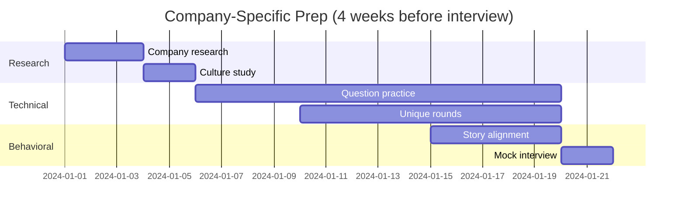

# Company-Specific Preparation - Overview

## Topic Definition and Importance

Company-specific preparation goes beyond generic interview skills to understand the unique aspects of each target company:

1. **Interview process variations**: Each company has distinct rounds and evaluation criteria
2. **Question styles**: Some companies use LeetCode, others prefer practical problems
3. **Cultural fit assessment**: Understanding company values and demonstrating alignment
4. **Technical focus areas**: Companies emphasize different technical domains

At staff level, cultural alignment becomes even more critical as you'll be expected to influence and lead within the organization.

## Scope and Boundaries

### In Scope
- Interview process breakdown by company
- Common question types and examples
- Company culture and values
- Technical focus areas
- Preparation strategies per company
- Resources for company research

### Out of Scope
- Detailed coding solutions (covered in Coding Rounds)
- System design deep dives (covered in System Design)
- General behavioral preparation (covered in Behavioral Rounds)

## Companies Covered

| Company | Interview Style | Key Focus |
|---------|-----------------|-----------|
| Stripe | Practical, non-LeetCode | Code quality, integration |
| Netflix | Real-world problems | Code hygiene, abstractions |
| OpenAI | Multi-part questions | Throughput, clean code |
| Anthropic | CodeSignal + onsite | Completion rate, modularity |
| Databricks | Systems-oriented | Deep understanding |
| Snowflake | Transaction/DB focus | Panel presentation |

## Learning Objectives

By completing this module, you will be able to:

1. **Understand interview processes** for each target company
2. **Prepare company-specific questions** effectively
3. **Research company culture** and demonstrate alignment
4. **Adapt preparation strategy** based on company focus
5. **Navigate unique interview formats** like integration rounds or panels

## Common Challenges and Solutions

### Challenge 1: Too Many Companies
**Problem**: Trying to prepare for every company at once
**Solution**:
- Prioritize 3-4 target companies
- Start with companies that have overlapping styles
- Generic prep covers 70%, specific prep adds 30%

### Challenge 2: Outdated Information
**Problem**: Interview processes change frequently
**Solution**:
- Check recent Glassdoor reviews
- Use platforms like Blind and Levels.fyi
- Network with recent interviewees
- Join company-specific Discord/Slack channels

### Challenge 3: Culture Fit Uncertainty
**Problem**: Unsure how to demonstrate cultural alignment
**Solution**:
- Study company engineering blogs
- Read culture decks (e.g., Netflix)
- Prepare stories that align with values
- Be authentic - fit goes both ways

### Challenge 4: Unique Round Types
**Problem**: Unfamiliar formats like bug squash or integration
**Solution**:
- Practice specific round types
- Understand evaluation criteria
- Time yourself realistically

## Company Research Framework

### Technical Research
1. **Engineering blog**: Understand technical philosophy
2. **Open source projects**: See coding standards
3. **Tech talks**: Learn about systems and challenges
4. **Job descriptions**: Identify key technologies

### Cultural Research
1. **Culture deck/values**: Official company values
2. **Glassdoor reviews**: Employee perspectives
3. **LinkedIn**: Team composition and backgrounds
4. **News**: Recent events and direction

### Interview Research
1. **Blind/Glassdoor**: Recent interview experiences
2. **LeetCode Discuss**: Question banks
3. **StaffEngPrep/HelloInterview**: Structured guides
4. **Networking**: Direct insights from employees

## Preparation Timeline by Company

## Company Groupings by Style

### Group A: Non-LeetCode Practical (Netflix, Stripe, OpenAI)
- Focus on code quality over algorithmic complexity
- Multi-part questions common
- Testing and edge cases evaluated
- **Prep focus**: Build real systems, write clean code

### Group B: CodeSignal/Online Assessment First (Anthropic)
- Automated scoring initial screen
- Completion rate critical
- Clean, modular code essential
- **Prep focus**: Timed practice, code cleanliness

### Group C: Systems-Heavy (Databricks, Snowflake)
- Deep technical knowledge required
- Database/distributed systems focus
- Presentation rounds possible
- **Prep focus**: System internals, articulation

## Success Metrics

### Before Interview
- [ ] Completed company research checklist
- [ ] Practiced 10+ company-specific questions
- [ ] Prepared 5+ aligned behavioral stories
- [ ] Understood unique round formats
- [ ] Reviewed recent interview experiences

### Interview Performance
- [ ] Demonstrated cultural awareness
- [ ] Handled question style confidently
- [ ] Showed relevant technical depth
- [ ] Asked insightful questions about company
