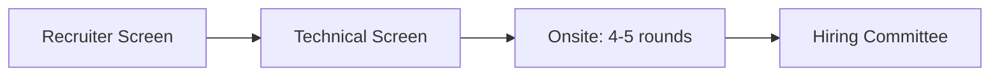
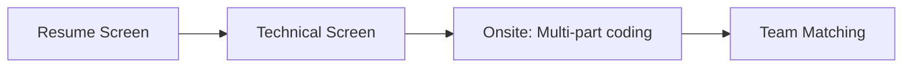
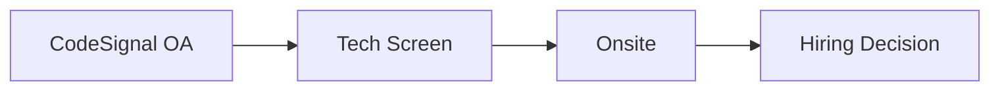
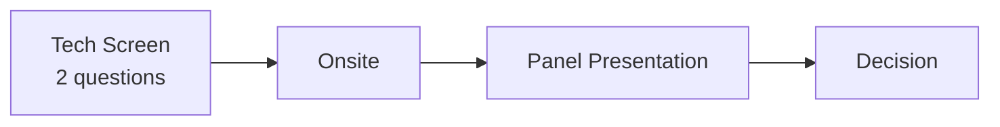

# Company-Specific - Company Profiles

## Stripe

### Company Overview
- **Focus**: Online payment infrastructure
- **Engineering Culture**: Craft-oriented, quality-focused
- **Key Values**: Users first, rigorous thinking, move with urgency

### Interview Process

**Round Types**:
1. **Coding Questions**: Real-life practical problems
2. **System Design**: Payment/financial systems focus
3. **Integration Round**: GitHub repo, JSON transformation
4. **Bug Squash**: Debugging failing tests

### Unique Aspects

**Integration Round**:
- Download GitHub repository
- Understand existing codebase
- Implement features or fix issues
- Focus on JSON handling, HTTP requests

**Bug Squash Round**:
- Given codebase with failing tests
- Find and fix bugs
- Explain root cause
- Example: YAML parser bugs, HTML template issues

### Coding Question Examples
- Currency conversion system
- Credit card validation
- HTTP headers parsing
- String expansion/compression
- Transaction ledger design

### System Design Topics
- Ledger API for transactions
- Metrics counter system
- Merchant webhook architecture
- Identity management
- Feature flag system
- TopK aggregation

### Preparation Tips
1. Practice non-LeetCode problems extensively
2. Focus on code readability and structure
3. Get comfortable with JSON/HTTP operations
4. Practice debugging unfamiliar codebases
5. Understand financial/payment concepts

---

## Netflix

### Company Overview
- **Focus**: Streaming entertainment
- **Engineering Culture**: Freedom & Responsibility
- **Key Values**: Judgment, communication, curiosity, courage

### Interview Process

**Focus Areas**:
- Code hygiene and abstractions
- Articulation of approach
- Real-world problem solving

### Coding Question Examples

**Data Structures Focus**:
- Duplicate detection with time windows
- History management (viewing history)
- Latency percentile tracking
- Cache implementations (LRU, weighted)
- Task scheduling systems

**Sample Problems**:
1. Detect repeated viewing patterns
2. Movie history management
3. Log deduplication within windows
4. Interval merging
5. Dependency resolution (course prereqs)
6. JSON parsing and navigation

### System Design Topics
- Distributed KV store
- Distributed cron scheduler
- Ad promotion system
- Coupon redemption with concurrency
- Video commerce platform
- Contact tracing system

### Culture Deck Key Points
- Context over control
- Highly aligned, loosely coupled
- Pay top of market
- Keeper test: Would you fight to keep this person?

### Preparation Tips
1. Read the Netflix Culture Deck
2. Practice articulating your approach clearly
3. Focus on clean abstractions
4. Prepare for non-LeetCode style
5. Understand streaming/recommendation concepts

---

## OpenAI

### Company Overview
- **Focus**: AI research and deployment
- **Engineering Culture**: Research-driven, high impact
- **Key Values**: Safety, broad benefit, long-term thinking

### Interview Process

**Emphasis**:
- Speed and code quality
- Multi-part question completion
- Bug-free implementation

### Coding Question Examples

**Resumable Iterators**:
- Design iterator with state capture
- Part A: Write tests for get_state/set_state
- Part B: Implement core interface
- Part C: Handle multiple JSON files

**In-Memory SQL Database**:
- Table creation
- Record insertion
- SELECT queries
- WHERE clauses with conditions
- ORDER BY functionality

**Versioned KV Store**:
- Version-tracked storage
- Thread-safe operations
- Future timestamp handling

**Additional Topics**:
- Unix cd command implementation
- Toy programming language
- Credit management system
- Excel sheet API

### System Design Topics
- Webhook service (1B events/day)
- Places of interest search
- Slack-like system
- CI/CD workflow system

### Preparation Tips
1. Practice multi-part questions
2. Focus on completing more parts
3. Write comprehensive tests
4. Ensure bug-free code
5. Understand AI/ML basics (helpful, not required)

---

## Anthropic

### Company Overview
- **Focus**: AI safety research
- **Engineering Culture**: Research-oriented, safety-first
- **Key Values**: Safety, beneficial AI, rigorous research

### Interview Process

**CodeSignal Assessment**:
- 4-level coding challenge
- Must complete 3+ levels
- Target score: 520+ out of 600
- Evaluated on: Completion, cleanliness, modularity

### CodeSignal Question Examples

**Inventory Management System** (4 levels):
- Level 1-2: Basic CRUD + prefix/suffix search
- Level 3: Multi-user with capacity
- Level 4: Duplicate handling

**Chat Messages History** (4 levels):
- Level 1-2: Storage, retrieval, filtering
- Level 3: Message expiration
- Level 4: Backup and restoration

### Key Evaluation Criteria
- High throughput coding
- Minimal bugs
- Good code hygiene
- Modular design
- Completion rate

### Preparation Tips
1. Practice timed 4-level problems
2. Focus on clean, modular code
3. Ensure high completion rate
4. Practice CodeSignal-style assessments
5. Understand AI safety concepts

---

## Databricks

### Company Overview
- **Focus**: Data and AI platform
- **Engineering Culture**: Technical excellence
- **Key Values**: Customer obsession, data-driven

### Interview Process

**Emphasis**:
- Deep understanding of coding and system design
- Practical, non-LeetCode problems
- Working solutions with clean code

### Coding Question Examples

**Shortest Path to HQ**:
- 2D grid navigation
- Multiple transport modes (walk, bike, car, train)
- Optimize for time, tiebreak on cost

**Snapshot Set**:
- HashSet with add/remove
- Snapshot functionality
- Iterate over snapshot state

**Concurrent Data Writer**:
- Thread-safe file writing
- Maintain per-thread ordering
- Maximize throughput

### System Design Topics
- Key-value store with locking
- Distributed file systems
- Stock trading system
- Collaborative playlist system

### Preparation Tips
1. Deep understanding of distributed systems
2. Practice concurrency problems
3. Understand Spark/data processing basics
4. Focus on systems-level thinking

---

## Snowflake

### Company Overview
- **Focus**: Cloud data platform
- **Engineering Culture**: Excellence in data
- **Key Values**: Put customers first, integrity, innovation

### Interview Process

**Unique Element**: Panel presentation (30 min, 5-6 interviewers)

### Coding Question Examples
- KV Store with transactions (nested)
- LRU Cache implementation
- Happy number detection
- Cron expression parser
- Versioned KV with point-in-time queries
- Async task scheduler
- Access control with role inheritance
- In-memory filesystem

### System Design Topics
- Distributed KV with versioning
- Quota service
- Blob storage deduplication
- Async task scheduler
- Distributed transactions (2PC)
- Rate limiter service
- Event subscription (1M QPS)

### Panel Presentation Tips
1. Choose a project you know deeply
2. Prepare for technical deep dives
3. Structure: Context → Problem → Solution → Results
4. Practice explaining to varied audiences
5. Anticipate questions about trade-offs

### Preparation Tips
1. Strong database/transaction knowledge
2. Practice presentation skills
3. Understand data warehousing concepts
4. Prepare for varied question types
