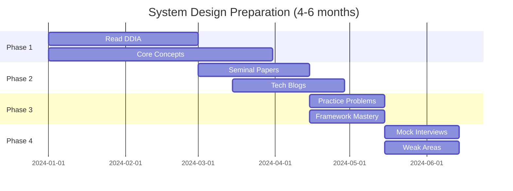

# System Design - Overview

## Topic Definition and Importance

System design interviews evaluate a candidate's ability to design large-scale distributed systems. At staff+ level, this becomes one of the most critical interview components because:

1. **Architectural ownership**: Staff engineers lead system design decisions
2. **Cross-team impact**: Design choices affect multiple teams and services
3. **Long-term thinking**: Must consider scalability, maintainability, and evolution
4. **Trade-off navigation**: Real-world constraints require balancing competing concerns

## Scope and Boundaries

### In Scope
- Distributed systems fundamentals
- Scalability patterns (horizontal/vertical scaling)
- Database design (SQL vs NoSQL, sharding, replication)
- Caching strategies
- Message queues and async processing
- Load balancing and service discovery
- Consistency models and CAP theorem
- Real-world system case studies
- Capacity estimation and back-of-envelope math
- API design and contracts

### Out of Scope
- Detailed implementation code (covered in coding rounds)
- Specific technology vendor choices (focus on concepts)
- DevOps and deployment specifics
- Pure theoretical computer science

## Learning Objectives

By completing this module, you will be able to:

1. **Structure system design discussions** using a proven framework
2. **Design scalable systems** handling millions of users
3. **Make informed trade-offs** between consistency, availability, and performance
4. **Estimate system capacity** using back-of-envelope calculations
5. **Identify bottlenecks** and propose solutions
6. **Communicate designs** clearly using diagrams and explanations
7. **Handle deep-dive questions** on any component

## Four-Phase Preparation Approach

### Phase 1: Foundation Building (2-3 months)
Focus on core distributed systems concepts:
- Scalability and performance
- Database internals
- Consistency and consensus
- Networking fundamentals

### Phase 2: Real-World Systems Study (1-2 months)
Study actual implementations:
- Seminal papers (GFS, Dynamo, Kafka, etc.)
- Tech company engineering blogs
- Case studies of production systems

### Phase 3: Interview-Specific Preparation (1 month)
Practice interview format:
- Common system design problems
- Interview framework and delivery
- Trade-off discussions

### Phase 4: Mock Interviews (1 month)
Practice under realistic conditions:
- Timed practice sessions
- Feedback collection
- Weak area identification

## Common Challenges and Solutions

### Challenge 1: Scope Management
**Problem**: Trying to design everything in limited time
**Solution**:
- Clarify requirements upfront
- Start with core functionality
- Explicitly defer non-critical features
- Time-box each section

### Challenge 2: Going Too Deep Too Early
**Problem**: Diving into implementation details before high-level design
**Solution**:
- Start with 30,000-foot view
- Get buy-in on overall approach
- Let interviewer guide depth
- "Let me know if you want me to go deeper on any area"

### Challenge 3: Missing Trade-offs
**Problem**: Presenting single solution without alternatives
**Solution**:
- Always discuss at least 2 options
- Explain why you chose your approach
- Acknowledge limitations of your design
- Be prepared to pivot if pushed

### Challenge 4: Weak Capacity Estimation
**Problem**: Unable to justify scale decisions
**Solution**:
- Practice back-of-envelope math
- Know key numbers (latency, throughput)
- Start with assumptions, refine as needed
- Keep calculations simple

### Challenge 5: Poor Communication
**Problem**: Disorganized presentation, unclear explanations
**Solution**:
- Use consistent framework
- Draw diagrams as you explain
- Check for understanding
- Summarize key points

## Interview Format

### Typical Structure (45-60 minutes)

| Phase | Time | Focus |
|-------|------|-------|
| Requirements | 5-8 min | Clarify scope, constraints, scale |
| High-Level Design | 10-15 min | Core components, data flow |
| Deep Dive | 15-20 min | Critical components, trade-offs |
| Scaling/Edge Cases | 10 min | Handle growth, failures |
| Wrap-up | 5 min | Questions, summary |

### Staff-Level Expectations

| Aspect | Senior | Staff | Staff+ |
|--------|--------|-------|--------|
| Scope | Given system | Define scope | Shape requirements |
| Depth | Key components | All components | Novel solutions |
| Trade-offs | Discuss when asked | Proactively raise | Drive decisions |
| Scale | Handle given scale | Propose scaling strategy | Design for evolution |
| Communication | Clear explanation | Guide discussion | Influence/mentor |

## Success Metrics

### During Interview
- [ ] Gathered all necessary requirements
- [ ] Proposed reasonable high-level design in first 15 min
- [ ] Discussed at least 3 trade-offs
- [ ] Performed capacity estimation
- [ ] Handled deep-dive questions confidently
- [ ] Addressed failure scenarios
- [ ] Left time for questions

### Evaluation Criteria

| Criteria | Weight | Description |
|----------|--------|-------------|
| Problem Solving | 30% | Approach, creativity, handling unknowns |
| Technical Knowledge | 25% | Understanding of distributed systems concepts |
| Design Quality | 25% | Scalability, reliability, maintainability |
| Communication | 20% | Clarity, organization, collaboration |

## Preparation Timeline

## Key Mindset Shifts for Staff Level

1. **From implementer to architect**: Focus on "what" and "why" over "how"
2. **From single system to ecosystem**: Consider interactions between systems
3. **From current state to evolution**: Design for change and growth
4. **From technology to business**: Align technical decisions with business goals
5. **From individual to collaborative**: Drive discussions, mentor others
