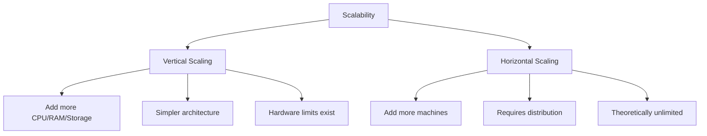
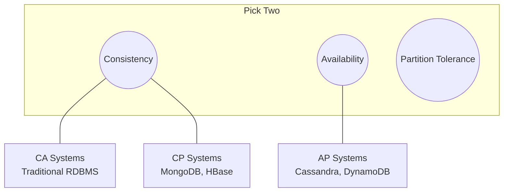
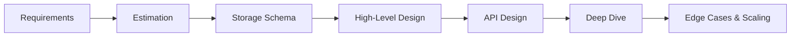
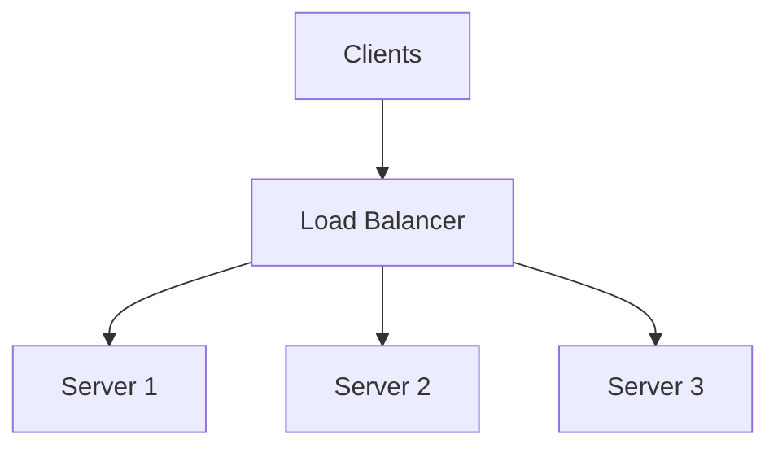
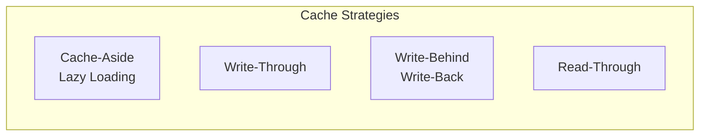
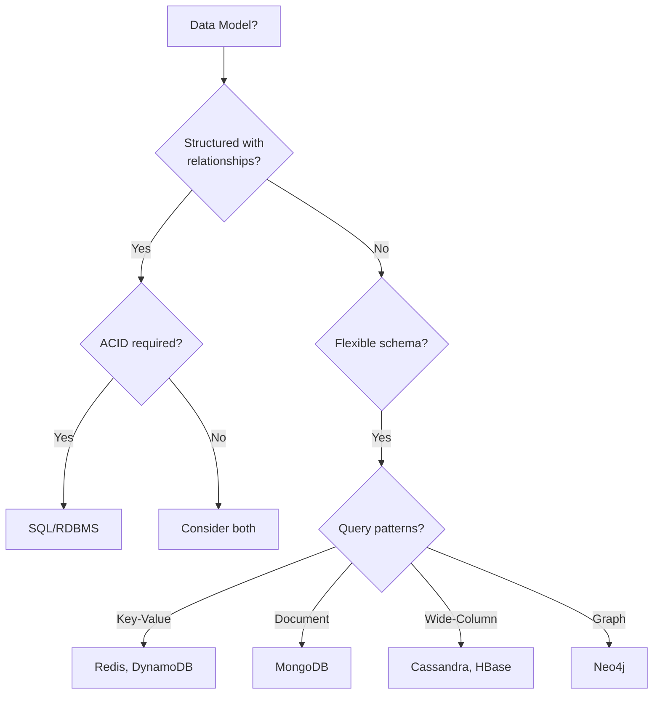
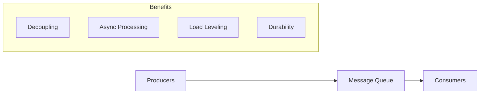
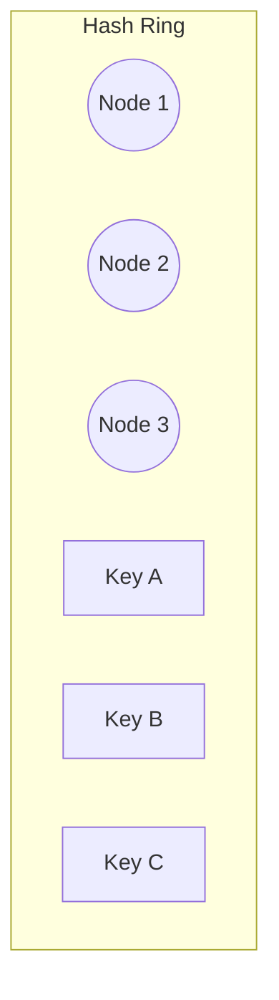
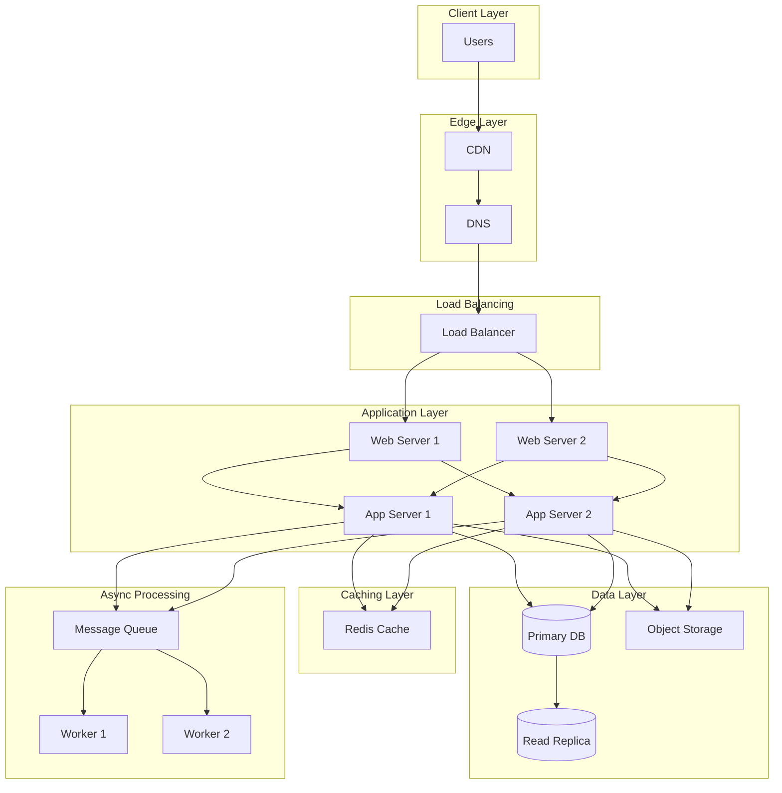
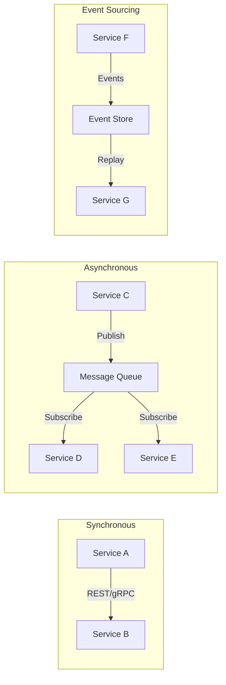

# System Design - Core Concepts

## Fundamental Principles

### 1. Scalability



**Vertical Scaling (Scale Up)**:
- Add more resources to existing machine
- Simpler to implement
- Has hardware ceiling
- Single point of failure

**Horizontal Scaling (Scale Out)**:
- Add more machines to the pool
- Requires distributed design
- Better fault tolerance
- More complex

### 2. CAP Theorem



**Consistency**: Every read receives the most recent write
**Availability**: Every request receives a response
**Partition Tolerance**: System continues despite network failures

**Reality**: In distributed systems, partition tolerance is required, so the choice is between CP and AP.

### 3. ACID vs BASE

| ACID (Traditional RDBMS) | BASE (NoSQL) |
|--------------------------|--------------|
| Atomicity | Basically Available |
| Consistency | Soft state |
| Isolation | Eventually consistent |
| Durability | |

## Key Terminology and Definitions

### Latency vs Throughput
- **Latency**: Time to complete single operation (ms)
- **Throughput**: Operations completed per time unit (QPS, TPS)

### Availability Levels
| Level | Downtime/Year | Description |
|-------|---------------|-------------|
| 99% | 3.65 days | Two nines |
| 99.9% | 8.76 hours | Three nines |
| 99.99% | 52.6 minutes | Four nines |
| 99.999% | 5.26 minutes | Five nines |

### Consistency Models
- **Strong Consistency**: Read always returns latest write
- **Eventual Consistency**: Read may return stale data, eventually converges
- **Causal Consistency**: Preserves cause-effect relationships
- **Read-your-writes**: User sees their own writes immediately

## Mental Models and Frameworks

### System Design Framework (RESHADE)



**R**equirements: Functional and non-functional requirements
**E**stimation: Scale, storage, bandwidth calculations
**S**torage: Data model and database choices
**H**igh-Level: Component architecture
**A**PI: Interface contracts
**D**eep Dive: Critical components in detail
**E**dge Cases: Failures, scaling, security

### Back-of-Envelope Numbers

| Metric | Value | Notes |
|--------|-------|-------|
| L1 cache reference | 0.5 ns | |
| L2 cache reference | 7 ns | |
| Main memory reference | 100 ns | |
| SSD random read | 150 μs | |
| HDD seek | 10 ms | |
| Network round trip (same datacenter) | 0.5 ms | |
| Network round trip (cross-continent) | 150 ms | |

| Storage | Size |
|---------|------|
| 1 character | 1-4 bytes (UTF-8) |
| UUID | 16 bytes |
| Timestamp | 8 bytes |
| 1 million rows × 1KB | 1 GB |
| 1 billion rows × 1KB | 1 TB |

### Capacity Estimation Template

```
Daily Active Users (DAU): ___
Actions per user per day: ___
Peak multiplier: ___ (typically 2-3x)

QPS = (DAU × actions/user) / 86400
Peak QPS = QPS × peak multiplier

Storage per action: ___ bytes
Daily storage = DAU × actions × storage/action
Yearly storage = Daily × 365 × retention_years
```

## Core Components

### 1. Load Balancers



**Algorithms**:
- Round Robin: Simple rotation
- Weighted Round Robin: Based on server capacity
- Least Connections: Route to least busy
- IP Hash: Consistent routing for same client
- Consistent Hashing: Minimize remapping on changes

**Layers**:
- L4 (Transport): TCP/UDP level, fast, less intelligent
- L7 (Application): HTTP level, can inspect content, more flexible

### 2. Caching



**Cache-Aside** (Most Common):
1. Application checks cache
2. If miss, fetch from database
3. Update cache with result

**Write-Through**:
1. Write to cache
2. Cache writes to database
3. Return success

**Write-Behind**:
1. Write to cache
2. Return immediately
3. Async write to database

**Eviction Policies**:
- LRU (Least Recently Used)
- LFU (Least Frequently Used)
- TTL (Time To Live)
- FIFO (First In First Out)

### 3. Databases

#### SQL vs NoSQL Decision



#### Sharding Strategies

**Horizontal Sharding** (Partitioning by rows):
- Range-based: Shard by date range, ID range
- Hash-based: Shard by hash(key) % num_shards
- Directory-based: Lookup table for shard mapping

**Challenges**:
- Cross-shard queries
- Rebalancing
- Hotspots

### 4. Message Queues



**Use Cases**:
- Async task processing
- Event-driven architectures
- Rate limiting / smoothing
- Cross-service communication

**Popular Systems**:
- Kafka: High throughput, log-based
- RabbitMQ: Feature-rich, traditional queue
- SQS: Managed, simple
- Redis Pub/Sub: Fast, in-memory

### 5. Consistent Hashing



**Benefits**:
- Minimal remapping when nodes added/removed
- Even distribution with virtual nodes
- Used in: Cassandra, DynamoDB, Memcached

**Algorithm**:
1. Hash nodes and keys onto ring (0 to 2^n)
2. Key belongs to first node clockwise
3. Virtual nodes: Each physical node has multiple positions

## Visual Diagrams

### Typical Web Application Architecture



### Microservices Communication Patterns



## Trade-off Decision Framework

### Consistency vs Availability

| Choose Consistency When | Choose Availability When |
|------------------------|-------------------------|
| Financial transactions | Social media feeds |
| Inventory management | Content delivery |
| User authentication | Analytics |
| Critical configuration | Logging |

### SQL vs NoSQL

| Choose SQL When | Choose NoSQL When |
|-----------------|-------------------|
| Complex queries needed | Simple key-value access |
| ACID required | Massive scale needed |
| Schema stability | Flexible schema |
| Joins are common | Denormalized data OK |

### Sync vs Async

| Choose Sync When | Choose Async When |
|------------------|-------------------|
| Immediate response needed | Can tolerate delay |
| Simple request-response | Long-running tasks |
| Strong consistency required | Decoupling needed |
| Low latency critical | High throughput needed |
