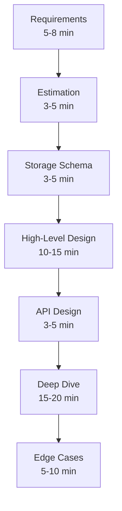
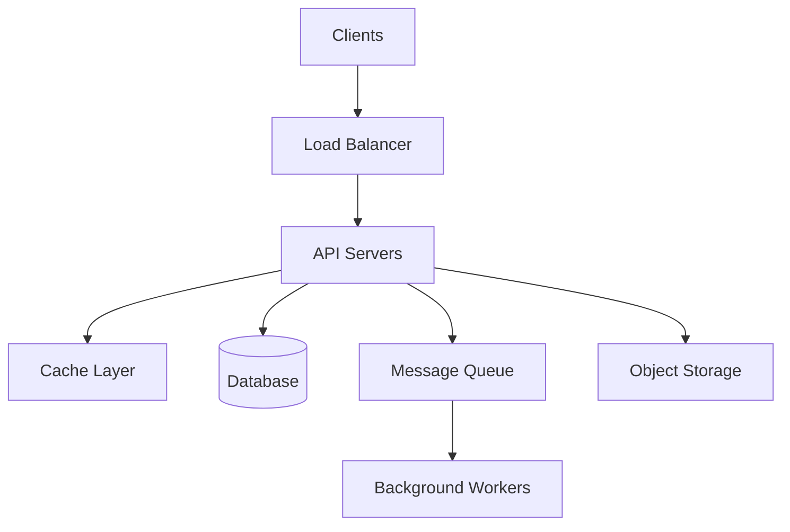
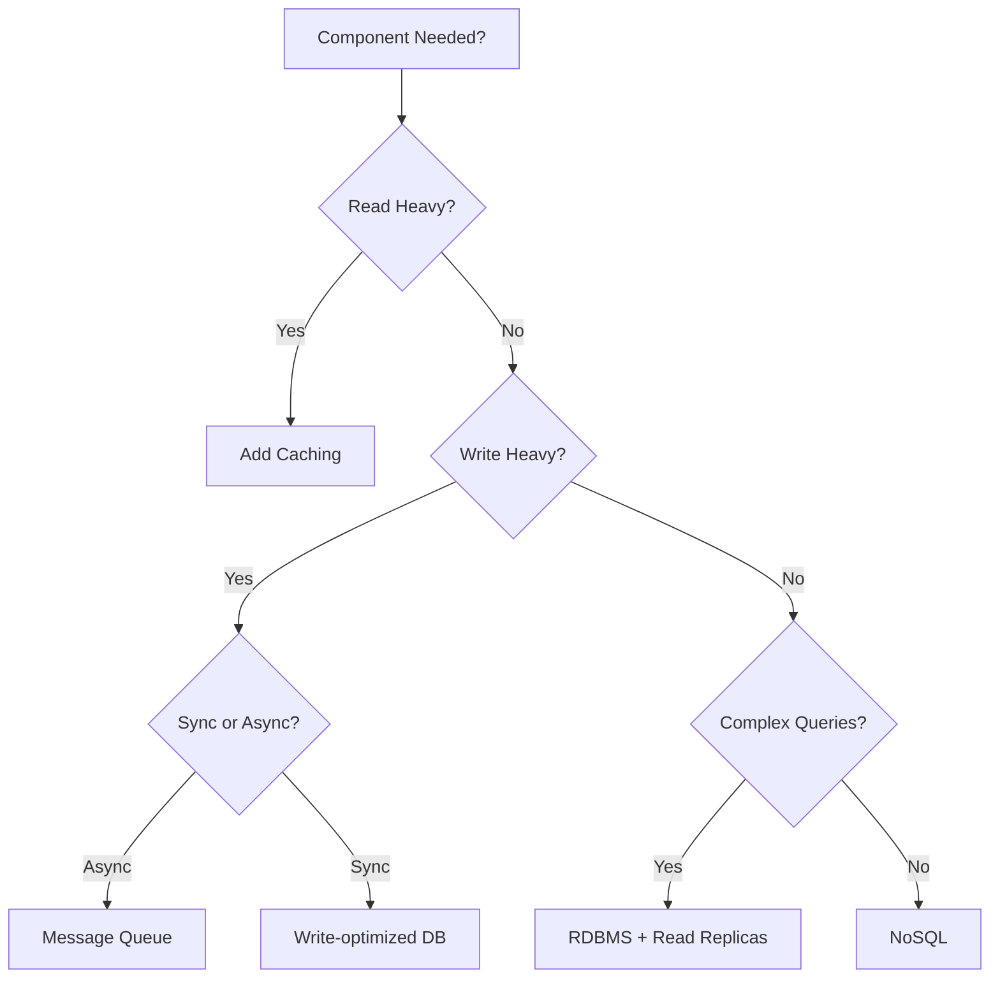
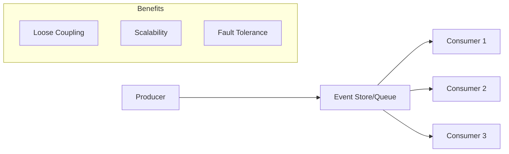
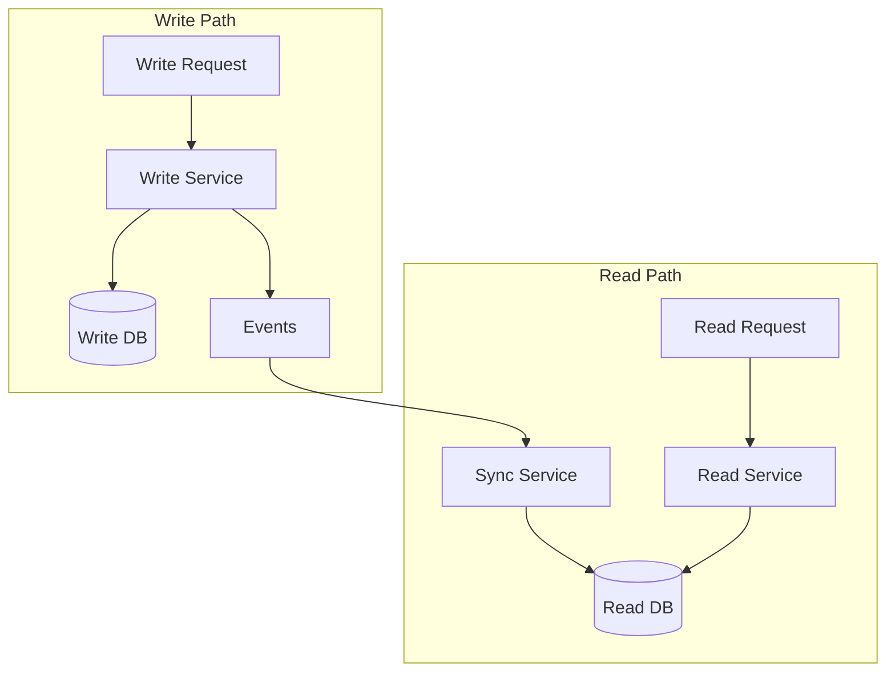
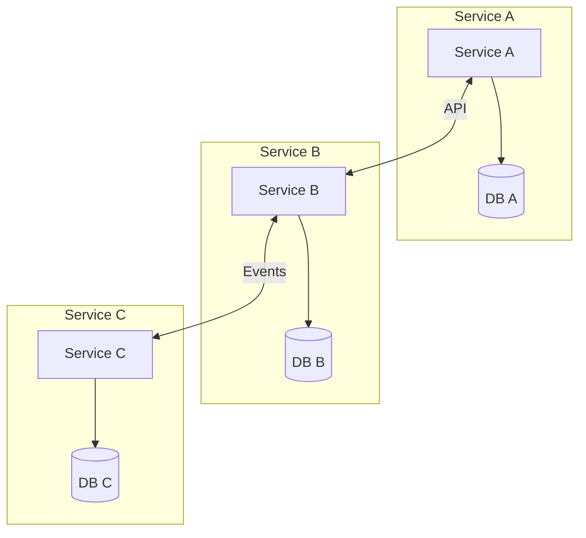
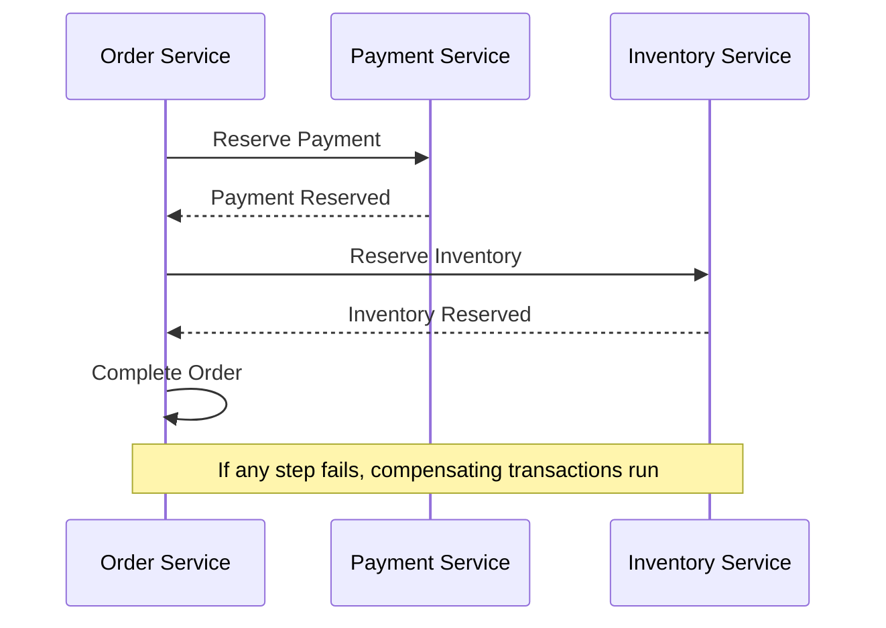
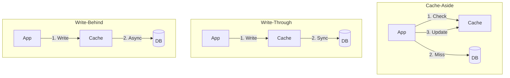
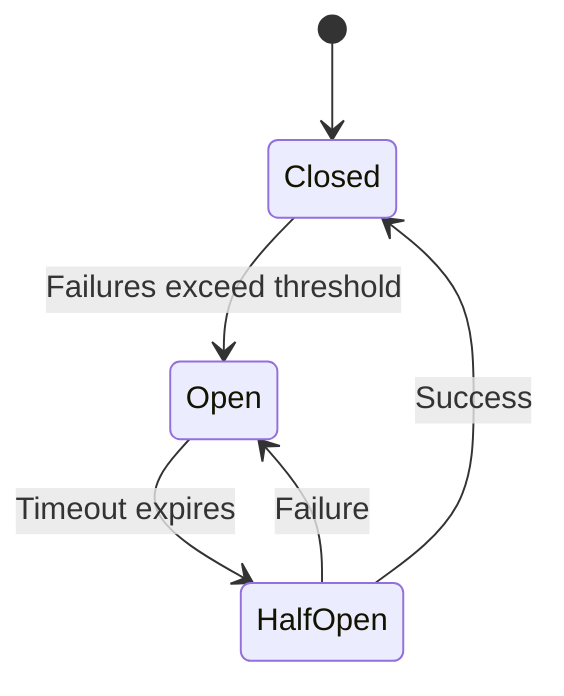

# System Design - Patterns and Frameworks

## System Design Interview Framework

### The RESHADE Framework



### Phase 1: Requirements (5-8 minutes)

**Functional Requirements**:
- What are the core features?
- Who are the users?
- What operations are supported?

**Non-Functional Requirements**:
- Scale: How many users? How much data?
- Performance: Latency requirements?
- Availability: What's acceptable downtime?
- Consistency: Strong or eventual?

**Template Questions**:
```
1. "What are the most important features to focus on?"
2. "How many daily active users should we design for?"
3. "What's the read/write ratio?"
4. "Are there any latency requirements?"
5. "Should we prioritize consistency or availability?"
```

### Phase 2: Estimation (3-5 minutes)

**Storage Estimation Template**:
```
Users: X million
Items per user: Y
Size per item: Z bytes

Total storage = X × Y × Z
Growth rate = % per year
5-year storage = Total × (1 + growth)^5
```

**Traffic Estimation Template**:
```
DAU: X million
Actions per user: Y
Total daily actions: X × Y

QPS = Total / 86,400
Peak QPS = QPS × 3 (typical peak multiplier)
```

**Bandwidth Estimation**:
```
Request size: X KB
Response size: Y KB
QPS: Z

Inbound: Z × X KB/s
Outbound: Z × Y KB/s
```

### Phase 3: High-Level Design (10-15 minutes)

**Core Components Template**:



**Component Selection Decision Tree**:



## Common Design Patterns

### Pattern 1: Event-Driven Architecture



**When to Use**:
- Asynchronous workflows
- Multiple consumers need same events
- Audit trail required
- Temporal decoupling needed

**Example Systems**: Order processing, activity feeds, notifications

### Pattern 2: CQRS (Command Query Responsibility Segregation)



**When to Use**:
- Very different read/write patterns
- Complex read queries
- High read-to-write ratio
- Eventual consistency acceptable

### Pattern 3: Database per Service (Microservices)



**Trade-offs**:
- Pro: Independent scaling, technology freedom
- Con: Distributed transactions, data consistency

### Pattern 4: Saga Pattern (Distributed Transactions)



**Compensation Actions**:
- If inventory reservation fails → release payment
- If order fails → release inventory + refund payment

### Pattern 5: Sharding Strategies

```mermaid
flowchart TD
    subgraph "Range-Based"
        A[Users A-M] --> S1[(Shard 1)]
        B[Users N-Z] --> S2[(Shard 2)]
    end

    subgraph "Hash-Based"
        C[hash(user_id) % N] --> S3[(Shard N)]
    end

    subgraph "Directory-Based"
        D[Lookup Service] --> S4[(Shards)]
    end
```

**Comparison**:
| Strategy | Pros | Cons |
|----------|------|------|
| Range | Range queries easy | Hotspots possible |
| Hash | Even distribution | Range queries hard |
| Directory | Flexible | Additional lookup |

### Pattern 6: Caching Patterns



### Pattern 7: Circuit Breaker



**States**:
- **Closed**: Normal operation, requests pass through
- **Open**: Fail fast, don't call failing service
- **Half-Open**: Test if service recovered

## Best Practices vs Anti-Patterns

### Best Practices

| Practice | Description |
|----------|-------------|
| Start simple | Add complexity only when needed |
| Design for failure | Assume components will fail |
| Use async when possible | Improves resilience and scalability |
| Cache aggressively | But have invalidation strategy |
| Monitor everything | Can't improve what you can't measure |
| Document decisions | Trade-offs and rationale |

### Anti-Patterns

| Anti-Pattern | Problem | Solution |
|--------------|---------|----------|
| Premature optimization | Over-engineering | Start simple, scale as needed |
| Single point of failure | No redundancy | Add replicas, failover |
| Synchronous everywhere | Tight coupling | Use queues for non-critical paths |
| Ignoring edge cases | Production failures | Plan for failures, rate limits |
| No monitoring | Blind to issues | Add metrics, logging, tracing |

## Decision Templates

### Database Selection Template

```
Requirements:
- Data model: [Structured/Unstructured/Semi-structured]
- Query patterns: [Simple lookups/Complex joins/Full-text search]
- Consistency needs: [Strong/Eventual]
- Scale: [GB/TB/PB]
- Read/Write ratio: [Read-heavy/Write-heavy/Balanced]

Options considered:
1. [Option A]: Pros: [...] Cons: [...]
2. [Option B]: Pros: [...] Cons: [...]

Decision: [Choice] because [Justification]
```

### Caching Strategy Template

```
Cache use case: [Read-through/Write-through/Cache-aside]

What to cache:
- [Item type 1]: TTL [X], Size [Y], Hit rate [Z%]
- [Item type 2]: TTL [X], Size [Y], Hit rate [Z%]

Eviction policy: [LRU/LFU/TTL]

Invalidation strategy:
- [Event-based/TTL-based/Manual]

Cache sizing:
- Working set: [X GB]
- Peak memory: [Y GB]
```

### Trade-off Discussion Template

```
Decision: [Component/Approach choice]

Options:
1. [Option A]
   - Pros: [...]
   - Cons: [...]

2. [Option B]
   - Pros: [...]
   - Cons: [...]

Chosen approach: [Choice]
Rationale: [Why this fits our requirements better]
Mitigation for cons: [How we address drawbacks]
```

## Common System Components Cheat Sheet

### Data Storage

| Need | Solution |
|------|----------|
| Structured data + transactions | PostgreSQL, MySQL |
| High write throughput | Cassandra, ScyllaDB |
| Flexible schema | MongoDB |
| Key-value at scale | DynamoDB, Redis |
| Full-text search | Elasticsearch |
| Graph relationships | Neo4j |
| Time series | InfluxDB, TimescaleDB |

### Communication

| Need | Solution |
|------|----------|
| Sync request-response | REST, gRPC |
| Async messaging | Kafka, RabbitMQ, SQS |
| Real-time updates | WebSocket, SSE |
| Service discovery | Consul, etcd, K8s DNS |

### Processing

| Need | Solution |
|------|----------|
| Background jobs | Celery, Sidekiq |
| Stream processing | Kafka Streams, Flink |
| Batch processing | Spark, Hadoop |
| Workflow orchestration | Temporal, Airflow |

### Infrastructure

| Need | Solution |
|------|----------|
| Load balancing | Nginx, HAProxy, ALB |
| CDN | CloudFront, Fastly |
| Object storage | S3, GCS, Azure Blob |
| Container orchestration | Kubernetes |
