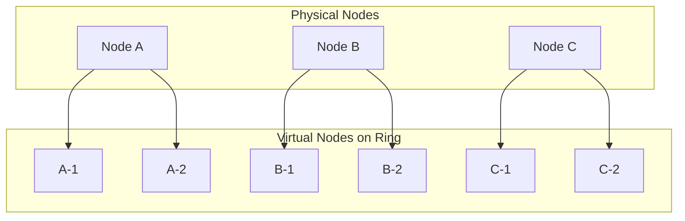
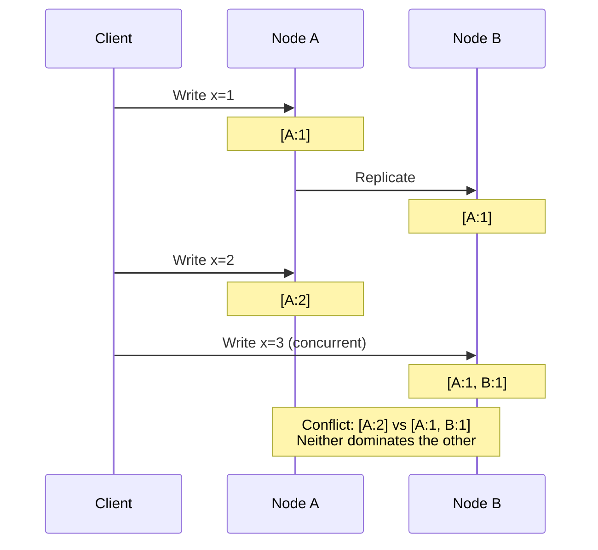
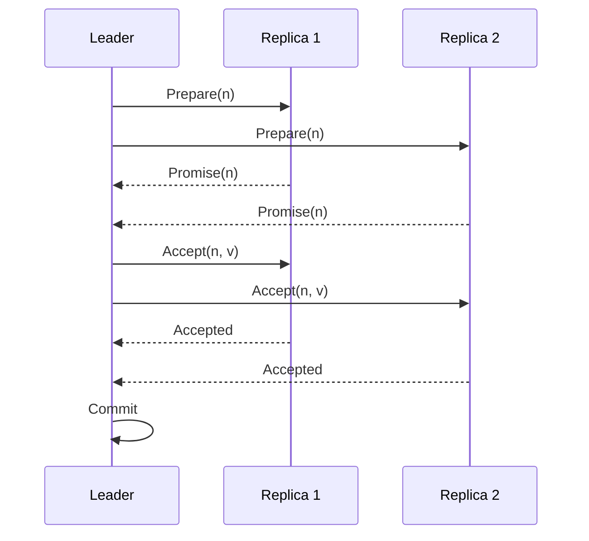
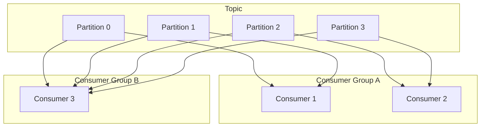
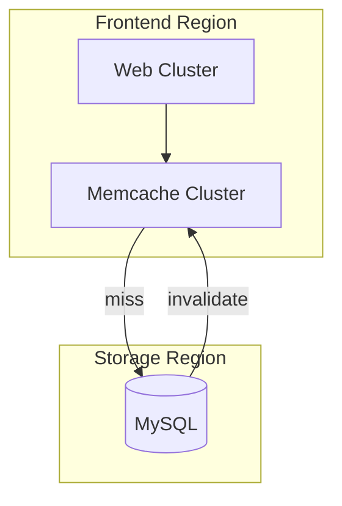
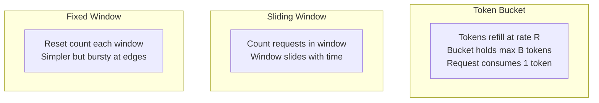
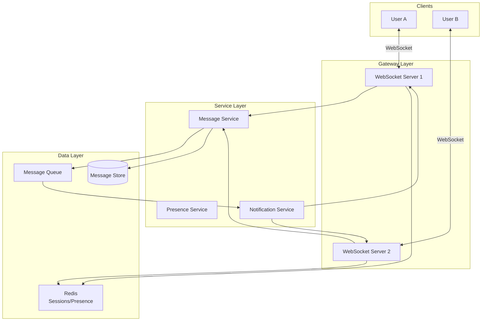
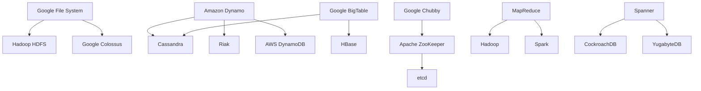

# System Design - Deep Dive Notes

## Deep Dive: Amazon Dynamo Paper

### Key Concepts

**Problem Statement**: Build a highly available key-value store for Amazon's core services where availability trumps consistency.

**Design Principles**:
1. Always writable: Never reject writes
2. Incremental scalability: Add nodes without downtime
3. Symmetry: All nodes have equal responsibilities
4. Decentralization: No master/leader
5. Heterogeneity: Support different hardware

### Consistent Hashing with Virtual Nodes



**Benefits of Virtual Nodes**:
- Even load distribution
- Heterogeneous hardware support
- Faster rebalancing on node changes

### Quorum-Based Consistency

**Configuration Parameters**:
- N: Number of replicas
- W: Write quorum (must write to W nodes)
- R: Read quorum (must read from R nodes)

**Guarantees**:
- If W + R > N: Strong consistency (overlap guaranteed)
- Common configs:
  - N=3, W=2, R=2: Balanced
  - N=3, W=1, R=1: High availability, eventual consistency
  - N=3, W=3, R=1: Write consistency, fast reads

### Vector Clocks for Versioning



**Resolution**: Client must reconcile conflicts (e.g., shopping cart: merge items)

### Merkle Trees for Anti-Entropy

Used to detect and repair inconsistencies between replicas:

```
        Root Hash
       /         \
    H(1,2)      H(3,4)
    /    \      /    \
  H(1)  H(2)  H(3)  H(4)
   |     |     |     |
  D1    D2    D3    D4
```

**Process**:
1. Compare root hashes
2. If different, compare children
3. Recursively find differing leaves
4. Sync only differing data

## Deep Dive: Google Spanner

### TrueTime API

**Problem**: How to achieve external consistency across global datacenters?

**Solution**: GPS receivers + atomic clocks provide bounded time uncertainty

```python
# TrueTime API
now() -> TTInterval(earliest, latest)
# Actual time is guaranteed to be within [earliest, latest]

# Uncertainty typically 1-7ms
```

**Commit Wait**:
1. Assign commit timestamp
2. Wait out uncertainty (until `latest` has passed)
3. Then commit is visible

### Paxos-Based Replication



### Directory and Placement

**Directories**: Unit of data placement
- Related rows grouped together
- Can span multiple Paxos groups
- Support move operations between datacenters

## Deep Dive: Kafka Architecture

### Log-Based Messaging

```mermaid
graph LR
    subgraph "Topic: orders"
        subgraph "Partition 0"
            P0[0|1|2|3|4|5]
        end
        subgraph "Partition 1"
            P1[0|1|2|3]
        end
        subgraph "Partition 2"
            P2[0|1|2|3|4]
        end
    end

    Producer --> P0
    Producer --> P1
    Producer --> P2

    P0 --> Consumer1
    P1 --> Consumer2
    P2 --> Consumer3
```

### Key Design Decisions

**Why Log-Based?**
- Sequential writes (fast on disk)
- Consumers track their own offset
- Replay capability
- Multiple consumer groups

**Partition Design**:
- Ordering guaranteed within partition
- Parallel consumption across partitions
- Key-based partitioning for related messages

### Consumer Groups



**Rebalancing**: When consumers join/leave, partitions are redistributed

### Exactly-Once Semantics

**Producer Idempotence**:
- Sequence numbers per producer-partition
- Broker detects and deduplicates

**Transactional Writes**:
- Atomic writes across partitions
- Two-phase commit protocol

## Deep Dive: Facebook Memcache Scaling

### Architecture Overview



### Key Challenges and Solutions

**Challenge 1: Thundering Herd**

Problem: Cache miss causes many concurrent DB queries

Solution: Leases
```python
def get_with_lease(key):
    value = cache.get(key)
    if value:
        return value

    lease = cache.get_lease(key)
    if lease.is_stale():
        # Another client is fetching, wait
        return wait_for_value(key)

    value = db.get(key)
    cache.set(key, value, lease)
    return value
```

**Challenge 2: Stale Sets**

Problem: Race between set and delete operations

Solution: Lease tokens
- Delete invalidates any outstanding leases
- Set only succeeds with valid lease

**Challenge 3: Cold Cluster Warming**

Problem: New cluster has empty cache (high DB load)

Solution: Cold cluster fetches from warm cluster first
```
Request → Cold Cluster → Warm Cluster → DB (if miss)
```

## Deep Dive: Common System Design Problems

### URL Shortener Design

**Requirements**:
- Shorten long URLs
- Redirect to original
- Scale: 500M new URLs/month, 100:1 read/write ratio

**Key Decisions**:

1. **ID Generation**:
   ```
   Options:
   - Auto-increment: Simple but predictable
   - UUID: No coordination but long
   - Base62 encoding of counter: Short, needs coordination

   Choice: Distributed counter with range allocation
   - Each server gets a range (1-10000, 10001-20000, ...)
   - Convert to base62 for short URL
   ```

2. **Storage**:
   ```
   Schema:
   - short_code (PK): VARCHAR(7)
   - original_url: TEXT
   - created_at: TIMESTAMP
   - user_id: BIGINT (optional)

   Choice: NoSQL (DynamoDB/Cassandra)
   - Simple key-value access
   - High write throughput
   - Easy horizontal scaling
   ```

3. **Caching**:
   ```
   - Cache popular URLs (80/20 rule)
   - LRU eviction
   - ~20% of URLs serve 80% of traffic
   ```

### Rate Limiter Design

**Requirements**:
- Limit requests per user/IP
- Different limits for different APIs
- Distributed (multiple servers)

**Algorithms**:



**Distributed Implementation**:
```python
# Using Redis
def is_allowed(user_id, limit, window_seconds):
    key = f"rate:{user_id}"
    current = redis.incr(key)

    if current == 1:
        redis.expire(key, window_seconds)

    return current <= limit
```

### Chat System Design

**Requirements**:
- 1:1 and group messaging
- Online presence
- Message history
- Read receipts

**Architecture**:



**Key Design Decisions**:

1. **Message Delivery**:
   - WebSocket for real-time
   - Fallback to long polling
   - Store and forward for offline users

2. **Message Storage**:
   - Partition by conversation_id
   - Time-series ordering
   - Consider Cassandra or similar

3. **Presence**:
   - Heartbeat-based
   - Redis for fast lookups
   - Publish presence changes via pub/sub

## Connection Between Papers and Real Systems



## Key Insights from Research

1. **Trade-offs are fundamental**: Every design decision involves trade-offs. Be explicit about what you're giving up.

2. **Simple solutions often win**: Start simple, add complexity only when needed. Google GFS used a single master for years.

3. **Embrace eventual consistency**: For many use cases, eventual consistency is acceptable and enables much better availability.

4. **Hardware matters**: Design should account for network latency, disk characteristics, and failure rates.

5. **Operations drive design**: Consider how the system will be monitored, debugged, and maintained.

6. **Idempotency is key**: In distributed systems, operations should be safe to retry.
